# Korea Crash 2026: การตรวจสอบเศรษฐกิจมหภาคและการคลายตัวของการกระจุกหุ้นเทคโนโลยี (Macro Check + Tech Concentration Unwind)

[](https://www.python.org/)
[](https://pandas.pydata.org/)
[](https://matplotlib.org/)
[](https://seaborn.pydata.org/)
[-orange.svg)](#)
[](#)
[](https://colab.research.google.com/github/atawuttecha/korea-crash-2026/blob/main/Korea_Crash_Visualization_CSV.ipynb)

> **การศึกษาเชิงประจักษ์ด้านวิทยาการข้อมูล (Empirical Data Science) เพื่อตรวจสอบสาเหตุเบื้องหลังการร่วงของดัชนี KOSPI ในปี 2026 โดยไล่ระดับจากภาพเศรษฐกิจมหภาค (Macro) ความตื่นตระหนกของตลาดโลก (Global Risk-Off) ไปจนถึงโครงสร้างการกระจุกตัวของตลาดหุ้นภายในประเทศ (Market Concentration) และร่องรอยเชิงพฤติกรรมของการปิดสถานะแบบถูกบังคับ (Forced Unwind)**

---

## 📋 Executive Summary

การร่วงของดัชนี KOSPI ในปี 2026 เกิดขึ้นอย่างรวดเร็วและรุนแรง แต่ไม่ปรากฏสัญญาณเตือนล่วงหน้าทั้งจากภาวะเศรษฐกิจถดถอย (Stagflation) และความตื่นตระหนกของตลาดการเงินโลก โครงการนี้ทดสอบสมมติฐาน 4 ข้อ (H1–H4) ด้วยข้อมูลเศรษฐกิจมหภาครายเดือนและข้อมูลตลาดรายสัปดาห์ ครอบคลุมช่วงเวลา 26 ปี (2000–2026) เปรียบเทียบกับวิกฤต Dot-com (2000), Global Financial Crisis (2008) และ COVID-19 (2020) โดยตรึงวันที่ข้อมูลไว้ที่ **18 กันยายน 2026** เพื่อให้ผลลัพธ์ทำซ้ำได้

### 🌟 สรุปผลลัพธ์สำคัญ (Key Findings)

1. **เศรษฐกิจจริงไม่ได้พัง:** อัตราการว่างงานเดือนมิถุนายนอยู่ที่ **2.75%** (กรกฎาคม 2.80%) และดัชนีชี้นำเศรษฐกิจ OECD CLI เดือนพฤษภาคมยังอยู่เหนือระดับ 100 ที่ **100.44** ไม่มีสัญญาณ Stagflation ในช่วง 12 เดือนก่อนจุดพีคของทั้ง 4 วิกฤต
2. **ตลาดโลกไม่ตื่นตระหนก:** VIX สูงสุดระหว่างการร่วงอยู่ที่เพียง **18.8** ต่ำกว่าค่าเฉลี่ยระยะยาว (19.9) เทียบกับ Dot-com (42.7) GFC (79.1) และ COVID-19 (66.0) และทองคำ YoY กลับ **ชะลอตัวลง** จาก +84.2% เหลือ +24.6% ระหว่างวิกฤต
3. **ความเสียหายกระจุกตัวผิดสัดส่วน:** หุ้น 5 อันดับแรก (CR5) มีน้ำหนักในดัชนี **54.0%** ณ จุดพีค แต่สร้างความเสียหายถึง **69.9%** ของมูลค่าตลาดที่หายไป (สูงกว่าน้ำหนักตัวเอง +15.9 จุด) ตรงข้ามกับ COVID-19 ที่ความเสียหายต่ำกว่าน้ำหนักตัวเอง
4. **ความเร็วผิดปกติ:** ดัชนีร่วง **-30.9% ภายใน 7 สัปดาห์** อัตราเฉลี่ย 4.4% ต่อสัปดาห์ ซึ่งเร็วที่สุดในบรรดา 4 วิกฤตที่ศึกษา (เร็วกว่า Dot-com และ GFC ราว 7–13 เท่า)
5. **แรงส่งจากหุ้นชิปสหรัฐฯ ถูกขยายผลในประเทศ:** Samsung และ SK Hynix ร่วง **2.51 เท่า** และ **3.51 เท่า** ของการร่วงของดัชนี SOX (สหรัฐฯ) ตามลำดับ ขณะที่ Nasdaq100 แทบไม่กระทบ (-2.2%)

**ข้อสรุปโดยรวม:** รูปแบบราคาสอดคล้องกับ **การปรับฐานของกลุ่มเซมิคอนดักเตอร์ที่ถูกขยายผลโดยโครงสร้างตลาดที่กระจุกตัว (consistent with a liquidation cascade)** มากกว่าวิกฤตเศรษฐกิจมหภาคหรือความตื่นตระหนกระดับโลก

---

## สารบัญ (Table of Contents)

- [นิยามศัพท์เฉพาะ (Definition of Terms)](#-นิยามศัพท์เฉพาะ-definition-of-terms)
- [สมมติฐานการวิจัย (Research Hypotheses)](#-สมมติฐานการวิจัย-research-hypotheses)
- [ตารางเปรียบเทียบ 4 วิกฤต (Comparative Crisis Summary)](#-ตารางเปรียบเทียบ-4-วิกฤต-comparative-crisis-summary)
- [รูปภาพและบทวิเคราะห์เชิงลึก (Visual Gallery & Analytical Insights)](#รูปภาพและบทวิเคราะห์เชิงลึก-visual-gallery--analytical-insights)
  * [Figure 1: ภาพรวมเศรษฐกิจมหภาค 2000–2026](#fig1)
  * [Figure 2: ดัชนีชี้นำเศรษฐกิจเทียบกับเงินเฟ้อ (Stagflation Check)](#fig2)
  * [Figure 3: แรงกดดันเงินเฟ้อจากฝั่งต้นทุนน้ำมัน](#fig3)
  * [Figure 4: ความกลัวของตลาดโลกและสินทรัพย์ปลอดภัย](#fig4)
  * [Figure 5: ค่าเงินวอนเป็นสัญญาณเตือนได้หรือไม่](#fig5)
  * [Figure 6: เปรียบเทียบความเร็วและความลึกของการร่วง](#fig6)
  * [Figure 7: ปัจจัยที่เคลื่อนไหวไปพร้อมกับ KOSPI มากที่สุด](#fig7)
  * [Figure 8: ใครคือผู้ลากดัชนีตลอด 10 ปี](#fig8)
  * [Figure 9: การกระจุกตัวของตลาด (CR5) เทียบกับการร่วงของดัชนี](#fig9)
  * [Figure 10: ความเสียหายกระจุกอยู่ที่ใคร และความผันผวนฉีกตัวหรือไม่](#fig10)
  * [Figure 11: วิกฤตโลกหรือวิกฤตเฉพาะเกาหลี](#fig11)
  * [Figure 12: หลักฐานเชิงพฤติกรรมของภาวะ Forced Unwind](#fig12)
- [แหล่งข้อมูลและข้อจำกัด (Data Sources & Limitations)](#-แหล่งข้อมูลและข้อจำกัด-data-sources--limitations)
- [ระเบียบวิธีวิจัย (Methodology)](#-ระเบียบวิธีวิจัย-methodology)
- [สรุปผลตามสมมติฐาน (Findings by Hypothesis)](#-สรุปผลตามสมมติฐาน-findings-by-hypothesis)
- [ข้อจำกัดของข้อมูลและงานในอนาคต (Limitations & Future Work)](#-ข้อจำกัดของข้อมูลและงานในอนาคต-limitations--future-work)
- [โครงสร้างคลังรหัส (Repository Structure)](#-โครงสร้างคลังรหัส-repository-structure)
- [วิธีการรันและการประมวลผลซ้ำ (How to Run & Reproduce)](#-วิธีการรันและการประมวลผลซ้ำ-how-to-run--reproduce)
- [การอนุญาตและการอ้างอิง (License & Citation)](#-การอนุญาตและการอ้างอิง-license--citation)

---

## 📘 นิยามศัพท์เฉพาะ (Definition of Terms)

| คำศัพท์ | คำอธิบาย |
|---|---|
| **KOSPI** | ดัชนีตลาดหลักทรัพย์รวมของเกาหลีใต้ (Korea Composite Stock Price Index) |
| **OECD CLI (Composite Leading Indicator)** | ดัชนีชี้นำเศรษฐกิจ ใช้คาดการณ์จุดเปลี่ยนของวัฏจักรเศรษฐกิจ ค่าเหนือ 100 หมายถึงแนวโน้มขยายตัว |
| **Stagflation** | ภาวะเศรษฐกิจชะลอตัวพร้อมเงินเฟ้อสูง ในรายงานนี้กำหนดเกณฑ์เป็น CLI < 100 และ CPI > 3% พร้อมกัน |
| **VIX** | ดัชนีวัดความผันผวนคาดการณ์ของตลาดหุ้นสหรัฐฯ (CBOE Volatility Index) ใช้เป็นตัวชี้วัดความกลัวของตลาดโลก |
| **CR5 (Concentration Ratio-5)** | สัดส่วนมูลค่าตลาดของหุ้น 5 อันดับแรกเทียบกับมูลค่าตลาดรวมทั้งดัชนี ใช้วัดการกระจุกตัว |
| **Z-score** | ค่ามาตรฐานที่วัดระยะห่างของค่าสังเกตจากค่าเฉลี่ยเป็นหน่วยส่วนเบี่ยงเบนมาตรฐาน ใช้ตรวจจับความผิดปกติของค่าเงิน |
| **Forced Unwind / Liquidation Cascade** | ภาวะที่นักลงทุนถูกบังคับปิดสถานะ (เช่นจาก Margin Call หรือการ rebalance ของ Leveraged ETF) ก่อให้เกิดแรงขายต่อเนื่อง |
| **Leveraged ETF** | กองทุนที่ให้ผลตอบแทนทวีคูณ (เช่น 2 เท่า) ของหุ้นอ้างอิงในแต่ละวัน ต้อง rebalance ทุกวันปิดตลาด |
| **Pass-Through / Transmission Lag** | ระยะเวลาและขนาดที่ตัวแปรต้นทาง (เช่นราคาน้ำมัน) ส่งผลไปยังตัวแปรปลายทาง (เช่นเงินเฟ้อ) |
| **Discount Rate vs. BOK Base Rate** | อัตราคิดลดที่ใช้แทนอัตราดอกเบี้ยนโยบายในชุดข้อมูล FRED (INTDSRKRM193N) ซึ่งต่ำกว่าอัตราดอกเบี้ยนโยบายจริงของธนาคารกลางเกาหลีราว 1.5 จุด |

---

## 🎯 สมมติฐานการวิจัย (Research Hypotheses)

**คำถามวิจัยหลัก:** การร่วงของดัชนี KOSPI ในปี 2026 มีสาเหตุมาจากปัจจัยมหภาค ความตื่นตระหนกระดับโลก หรือโครงสร้างตลาดภายในประเทศ?

- **H1 — เศรษฐกิจชะลอตัวพร้อมเงินเฟ้อสูง (Stagflation):** มีสัญญาณ Stagflation ก่อตัวก่อนวิกฤตหรือไม่ และเงินเฟ้อที่ขยับขึ้นมาจากราคาน้ำมันหรือไม่
- **H2 — ความตื่นตระหนกระดับโลก / ค่าเงิน:** ความกลัวของตลาดการเงินโลก (VIX) หรือค่าเงินวอนที่อ่อนตัวเป็นตัวจุดชนวนหรือไม่
- **H3 — ความเปราะบางจากการกระจุกตัวของตลาด:** ดัชนี KOSPI พึ่งพาหุ้นกลุ่มเซมิคอนดักเตอร์มากเกินไปจนเปราะบางหรือไม่
- **H4 — การส่งผ่านจากหุ้นเทคสหรัฐฯ:** แรงกระแทกจากหุ้นชิปสหรัฐฯ ส่งผ่านมาและถูกขยายผลภายในตลาดเกาหลีหรือไม่

---

## 📊 ตารางเปรียบเทียบ 4 วิกฤต (Comparative Crisis Summary)

| ตัวชี้วัด | Dot-com (2000) | GFC (2008) | COVID-19 (2020) | Korea Crash 2026 |
|---|---|---|---|---|
| **ความลึกของการร่วง (Peak-to-Trough)** | — | — | **-30.4%** | **-30.9%** |
| **ระยะเวลาร่วง (สัปดาห์)** | 90 | 52 | 9 | **7** |
| **อัตราการร่วงเฉลี่ยต่อสัปดาห์** | 0.6% | 1.0% | 3.4% | **4.4%** (สูงสุด) |
| **VIX สูงสุด** | 42.7 | 79.1 | 66.0 | **18.8** (ต่ำสุด) |
| **CR5 ณ จุดพีค** | — | — | 24.1% | **54.0%** |
| **สัดส่วนความเสียหายจาก Top-5** | — | — | 19.8% (ต่ำกว่าน้ำหนัก) | **69.9%** (สูงกว่าน้ำหนัก) |
| **สัญญาณ Stagflation ก่อนพีค (เดือน)** | 0 | 0 | 0 | **0** |

> หมายเหตุ: บางช่องไม่มีข้อมูล (—) เนื่องจากรายงานต้นฉบับคำนวณตัวชี้วัดบางตัว (เช่น CR5 และสัดส่วนความเสียหาย) เฉพาะ COVID-19 และ 2026 เพื่อเป็นกรณีเทียบเคียงหลัก

---

## รูปภาพและบทวิเคราะห์เชิงลึก (Visual Gallery & Analytical Insights)

> **หมายเหตุการอ่านกราฟ:** ใน Figure 1–3 **วงกลมสีม่วง** ใช้ชี้จุดที่ต้องสังเกตเป็นพิเศษ (เช่น จุดพีคของดัชนี ค่าล่าสุดของ GDP/CLI/CPI และจุดที่ราคาน้ำมันกระโดด) **แถบสีจาง** คลุมช่วงพีคถึงจุดต่ำสุดของแต่ละวิกฤตด้วยสีเดียวกันทุกกราฟ และมุมซ้ายบนของแต่ละแผงระบุความถี่ของข้อมูล (weekly / monthly / quarterly)

<a id="fig1"></a>
### Figure 1 · ภาพรวมเศรษฐกิจมหภาค 2000–2026

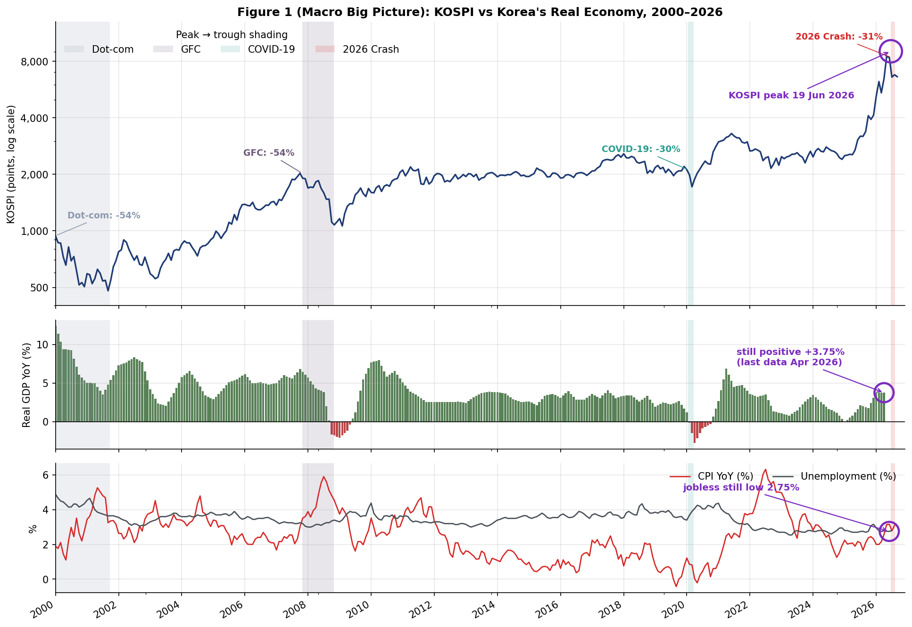

**คำถามของกราฟ:** วิกฤตปี 2026 เกิดขึ้นพร้อมกับการพังทลายของเศรษฐกิจจริงเหมือน 3 วิกฤตในอดีตหรือไม่

**สิ่งที่กราฟแสดง:** สามแผงบนแกนเวลาเดียวกัน แต่ละแผงแสดงตามความถี่จริงของข้อมูล — KOSPI **รายสัปดาห์** (มาตราส่วนลอการิทึม ลูกศรของแต่ละวิกฤตชี้ที่จุดต่ำสุด), Real GDP YoY **รายไตรมาส** (1 แท่ง = 1 ไตรมาสที่ BOK ประกาศจริง) และ CPI YoY กับอัตราการว่างงาน **รายเดือน** แถบสีคลุมช่วงพีคถึงจุดต่ำสุดของทั้ง 4 วิกฤต

**ข้อสรุปสำคัญ:** อัตราการว่างงานอยู่ที่ 2.75% (มิ.ย.) และ 2.80% (ก.ค.) เงินเฟ้ออยู่ที่ 3.16% และ 2.79% ตามลำดับ ใกล้เคียงระดับปกติ ส่วน GDP YoY ล่าสุดที่ประกาศจริง (Q2 2026) ยังเป็นบวกที่ +3.75% ต่างจาก 3 วิกฤตในอดีตที่ดัชนีร่วงพร้อมเศรษฐกิจจริงชะลอตัวหรือหดตัว **สรุป:** การร่วงปี 2026 ไม่มีลักษณะของวิกฤตเศรษฐกิจมหภาคภายในประเทศ

> **ข้อควรระวัง:** GDP แสดงเป็นรายไตรมาสตามความถี่จริง (ไม่ประมาณค่ารายเดือน) แท่งสุดท้ายคือ Q2 2026 ซึ่งเป็นไตรมาสล่าสุดที่ BOK ประกาศ ณ วันดึงข้อมูล ไม่ใช่ ณ วันเกิดเหตุ เพราะ Q3 2026 ยังไม่จบ | **ที่มา:** KOSPI (yfinance) · Real GDP (FRED) · CPI (OECD SDMX) · Unemployment (FRED)

---

<a id="fig2"></a>
### Figure 2 · ดัชนีชี้นำเศรษฐกิจเทียบกับเงินเฟ้อ (Stagflation Check)

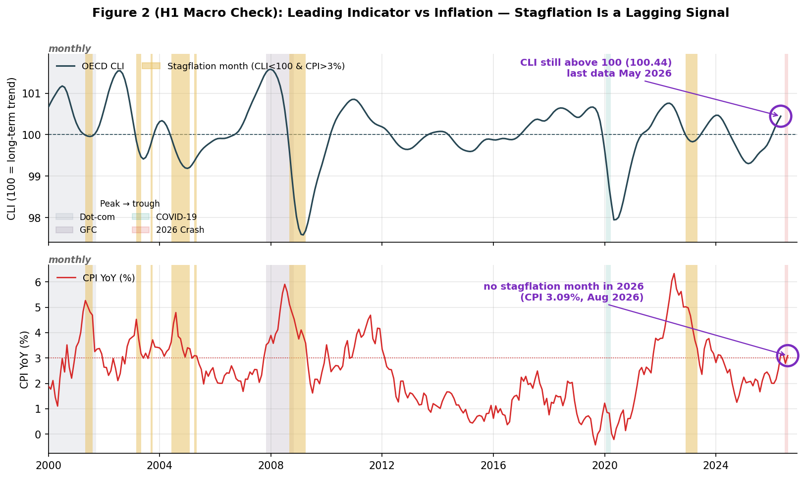

**คำถามของกราฟ:** ก่อนเกิดวิกฤต มีสัญญาณ Stagflation ก่อตัวขึ้นหรือไม่

**สิ่งที่กราฟแสดง:** สองแผงซ้อนกันบนแกนเวลาเดียวกัน — แผงบนคือ OECD CLI (เส้นประที่ 100) แผงล่างคือ CPI YoY (เส้นประที่ 3%) **แถบสีทอง**ระบายเดือนที่เข้าเงื่อนไข Stagflation (CLI < 100 และ CPI > 3% พร้อมกัน) และแถบสีจางคลุมช่วงพีคถึงจุดต่ำสุดของ 4 วิกฤตแบบเดียวกับ Figure 1 · แยกเป็นสองแผงแทนกราฟสองแกน Y เพราะสองแกนที่ตั้งสเกลแยกกันทำให้ตำแหน่งที่เส้นตัดกันไม่มีความหมายทางสถิติ

**ข้อสรุปสำคัญ:** ไม่มีวิกฤตใดใน 4 ครั้งที่เกิดสัญญาณ Stagflation ในช่วง 12 เดือนก่อนจุดพีค (ทุกวิกฤต = 0 เดือน) สัญญาณที่เคยเกิดในปี 2001 และ 2008 เกิดขึ้น**ระหว่าง**ที่ตลาดกำลังร่วงแล้ว จึงเป็นตัวชี้วัดตามหลัง ไม่ใช่สัญญาณเตือนล่วงหน้า CLI เดือนพฤษภาคม 2026 อยู่ที่ 100.44 เหนือระดับ 100

> **ข้อควรระวัง:** CLI มีข้อมูลถึงเดือน พ.ค. 2026 เท่านั้น (ก่อนจุดพีค 1 เดือน) เกณฑ์ CPI > 3% เป็นเกณฑ์เฝ้าระวังที่ผู้จัดทำกำหนดเอง (เป้าหมายเงินเฟ้อจริงของ BOK คือ 2%) | **ที่มา:** OECD CLI และ CPI จาก OECD SDMX

---

<a id="fig3"></a>
### Figure 3 · แรงกดดันเงินเฟ้อจากฝั่งต้นทุนน้ำมัน

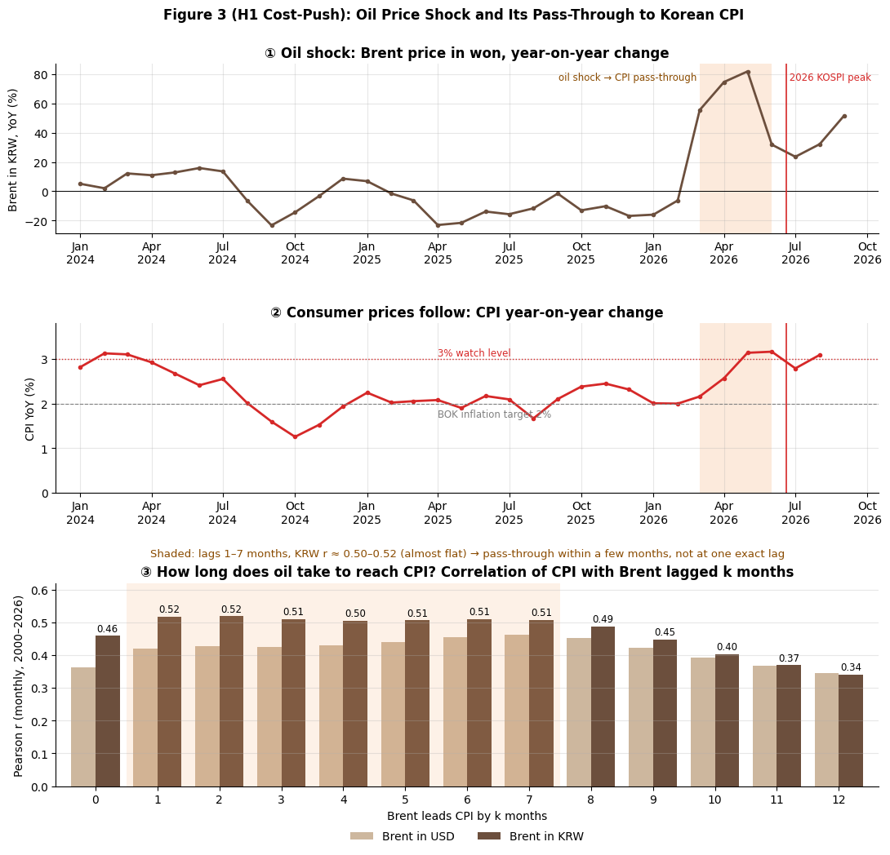

**คำถามของกราฟ:** เงินเฟ้อที่ขยับขึ้นก่อนวิกฤตมาจากราคาน้ำมันหรือไม่ และส่งผ่านด้วยความล่าช้ากี่เดือน

**สิ่งที่กราฟแสดง:** สามแผงเรียงบนลงล่าง — ① ราคาเบรนท์สกุลวอนแบบ YoY ② CPI YoY พร้อมเส้นเป้าหมาย 2% และเส้นเฝ้าระวัง 3% ③ การตรวจสอบเชิงสถิติ: กราฟเส้นแสดงว่าราคาน้ำมันเมื่อ k เดือนก่อนสัมพันธ์กับเงินเฟ้อเดือนปัจจุบันมากแค่ไหน (2000–2026) ยิ่งจุดสูงยิ่งสัมพันธ์กันมาก (**แกนนอนแผงนี้คือจำนวนเดือนที่น้ำมันนำหน้า ไม่ใช่วันที่**) · ในแผง ① ② **แถบสีฟ้าอมเทา**คือช่วงน้ำมันพุ่งและส่งผ่าน (มี.ค.–มิ.ย. 2026) และ**แถบสีชมพู**คือช่วงวิกฤต 2026 (19 มิ.ย. → 7 ส.ค.) ซึ่งเริ่มต่อจากแถบฟ้าแทบทันที · วงกลมสีม่วงชี้จุดที่ต้องสังเกตในแต่ละแผง

**ข้อสรุปสำคัญ:** ราคาเบรนท์กระโดดจาก 71.12 เป็น 109.72 ดอลลาร์ (+54% ภายในเดือนเดียว, ก.พ.→มี.ค. 2026) เงินเฟ้อทะลุ 3% ครั้งแรกในเดือน พ.ค. (3.14%) และยังอยู่เหนือ 3% ในเดือน มิ.ย. ตรงกับช่วงจุดพีคของดัชนี ความสัมพันธ์สูงที่สุดในช่วง lag 1–7 เดือน (r ≈ 0.50–0.52 เกือบเท่ากันทั้งช่วง) และจางลงหลังเดือนที่ 8 จึงสรุปได้เพียงว่า **ส่งผ่านภายในไม่กี่เดือน ไม่ใช่เดือนใดเดือนหนึ่งที่แน่นอน** อัตราดอกเบี้ยไม่เปลี่ยนแปลงตลอดช่วง → เงินเฟ้อจากฝั่งต้นทุนที่นโยบายการเงินไม่ได้ตอบสนอง

> **ข้อควรระวัง:** r ≈ 0.52 อธิบายความแปรปรวนได้เพียงราว 1 ใน 4 (r² ≈ 0.27) จึงเป็นปัจจัยร่วม ไม่ใช่สาเหตุเดียว · เส้น 2% คือเป้าหมายเงินเฟ้อทางการของ BOK ส่วนเส้น 3% เป็นเกณฑ์เฝ้าระวังที่งานนี้กำหนดเอง · ห้ามสรุปเรื่องอัตราดอกเบี้ยที่แท้จริงเพราะซีรีส์ที่มีเป็น Discount Rate | **ที่มา:** Brent และ USDKRW (FRED) · CPI (OECD SDMX) · Discount Rate (FRED INTDSRKRM193N)

---

<a id="fig4"></a>
### Figure 4 · ความกลัวของตลาดโลกและสินทรัพย์ปลอดภัย

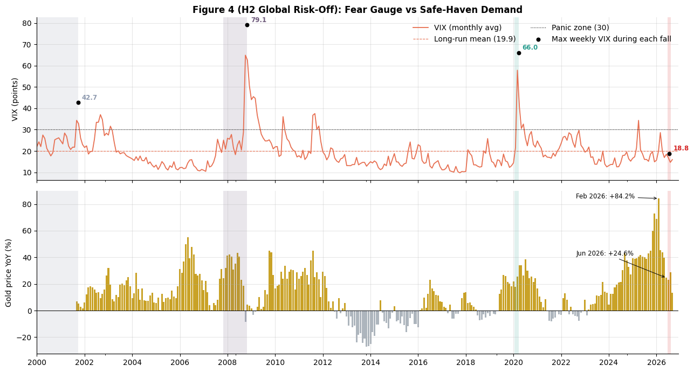

**คำถามของกราฟ:** การร่วงของ KOSPI ปี 2026 เกิดจากความตื่นตระหนกของตลาดการเงินโลกหรือไม่

**สิ่งที่กราฟแสดง:** แผงบนคือ VIX รายเดือนพร้อมเขตตื่นตระหนกที่ 30 และจุด VIX สูงสุดรายสัปดาห์ระหว่างการร่วงของแต่ละวิกฤต แผงล่างคือราคาทองคำ YoY

**ข้อสรุปสำคัญ:** ใน 3 วิกฤตก่อนหน้า VIX ทะลุ 30 ทุกครั้ง (Dot-com 42.7, GFC 79.1, COVID-19 66.0) แต่ปี 2026 สูงสุดเพียง 18.8 ต่ำกว่าค่าเฉลี่ยระยะยาว (19.9) ทองคำ YoY ชะลอตัวจาก +84.2% เหลือ +24.6% ไม่มีแรงซื้อสินทรัพย์ปลอดภัยรอบใหม่ระหว่างวิกฤต **สรุป:** ไม่ได้มาจากภาวะ Global Risk-Off

> **ข้อควรระวัง:** ทองคำยังเติบโตเกิน 20% YoY ตลอดช่วงวิกฤต จึงต้องเขียนว่า "ชะลอตัว" ไม่ใช่ "ลดลงต่ำกว่า 20%" | **ที่มา:** VIX และ Gold Futures (GC=F) จาก yfinance

---

<a id="fig5"></a>
### Figure 5 · ค่าเงินวอนเป็นสัญญาณเตือนได้หรือไม่

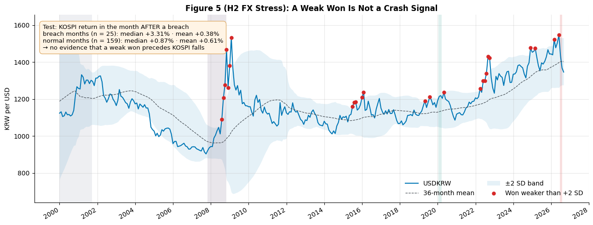

**คำถามของกราฟ:** ค่าเงินวอนที่อ่อนผิดปกติ ใช้เป็นสัญญาณเตือนล่วงหน้าได้หรือไม่

**สิ่งที่กราฟแสดง:** USDKRW พร้อมกรอบค่าเฉลี่ยเคลื่อนที่ 36 เดือน ± 2 SD จุดสีแดงคือเดือนที่ค่าเงินอ่อนทะลุกรอบบน (Z > 2)

**ข้อสรุปสำคัญ:** ตั้งแต่ปี 2000 มีเดือนที่ทะลุกรอบ +2 SD ทั้งหมด 25 เดือน ผลตอบแทน KOSPI เดือนถัดไปมีมัธยฐาน +3.31% ไม่ต่างจากเดือนปกติอย่างมีนัยสำคัญ → **ไม่พบหลักฐาน**ว่าค่าเงินอ่อนนำไปสู่การร่วง เดือน มิ.ย. 2026 ค่าเงินอยู่ที่ 1,549 วอน/ดอลลาร์ (Z = 2.21) ทะลุกรอบพอดีกับจุดพีค แต่หลักฐานเชิงสถิติชี้ว่าไม่ใช่ตัวจุดชนวน

> **ข้อควรระวัง:** ใช้ผลตอบแทนเดือนถัดไปเพื่อหลีกเลี่ยง look-ahead bias กลุ่มตัวอย่างมีเพียง 25 เดือน ไม่ได้ทดสอบนัยสำคัญทางสถิติ | **ที่มา:** USDKRW (FRED) · KOSPI (yfinance)

---

<a id="fig6"></a>
### Figure 6 · เปรียบเทียบความเร็วและความลึกของการร่วง

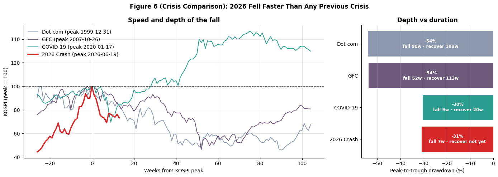

**คำถามของกราฟ:** รูปแบบการร่วงของปี 2026 แตกต่างจากวิกฤตในอดีตอย่างไร

**สิ่งที่กราฟแสดง:** แผงซ้ายซ้อนเส้นทางราคาของทั้ง 4 วิกฤต (จุดพีค = 100) แผงขวาคือความลึกพร้อมระยะเวลาร่วงและฟื้นตัว

**ข้อสรุปสำคัญ:** ความลึกปี 2026 (-30.9%) ใกล้เคียง COVID-19 (-30.4%) แต่ใช้เวลาเพียง 7 สัปดาห์ เทียบกับ 9 สัปดาห์ เร็วกว่า Dot-com (90 สัปดาห์) และ GFC (52 สัปดาห์) ราว 7–13 เท่า อัตราการร่วงเฉลี่ย 4.4% ต่อสัปดาห์สูงที่สุดในบรรดา 4 วิกฤต สอดคล้องกับการปรับสถานะแบบเร่งด่วนมากกว่าการปรับมุมมองต่อปัจจัยพื้นฐาน

> **ข้อควรระวัง:** สถานะ ณ วันที่ 18 ก.ย. 2026 ดัชนีอยู่ราว 6,627 จุด (ต่ำกว่าพีค ~26.8%) ตัวเลขนี้อาจเปลี่ยนเมื่อมีข้อมูลเพิ่ม | **ที่มา:** KOSPI จาก yfinance

---

<a id="fig7"></a>
### Figure 7 · ปัจจัยที่เคลื่อนไหวไปพร้อมกับ KOSPI มากที่สุด

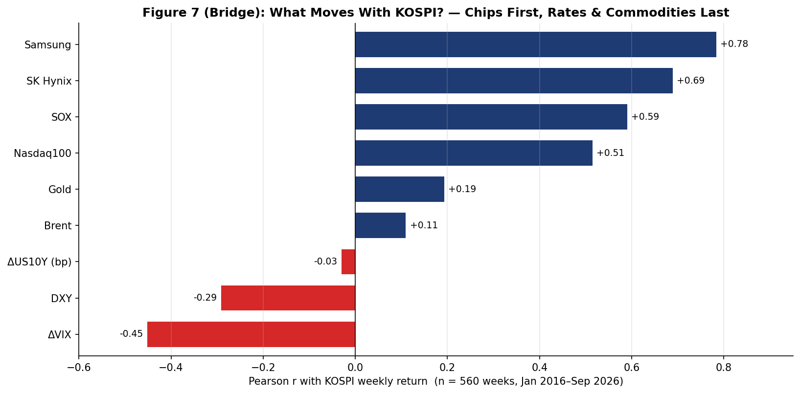

**คำถามของกราฟ:** ในรอบ 10 ปี อะไรคือปัจจัยที่สัมพันธ์กับการเคลื่อนไหวของ KOSPI มากที่สุด

**สิ่งที่กราฟแสดง:** แท่งแนวนอนเรียงค่าสหสัมพันธ์ (Pearson r) ระหว่างผลตอบแทนรายสัปดาห์ของ KOSPI กับตัวแปร 9 ตัว (2016–2026)

**ข้อสรุปสำคัญ:** สองอันดับแรกคือหุ้นชิปในประเทศ Samsung (r = 0.78) และ SK Hynix (r = 0.69) ตามด้วย SOX (0.59) และ Nasdaq100 (0.51) ส่วนสินค้าโภคภัณฑ์และอัตราดอกเบี้ยสัมพันธ์น้อยที่สุด (Gold +0.19, Brent +0.11) ΔVIX สัมพันธ์เชิงลบปานกลาง (-0.45) ยิ่งตอกย้ำว่าการที่ VIX ไม่ขยับเลยในปี 2026 ไม่ใช่รูปแบบปกติ

> **ข้อควรระวัง:** Samsung และ SK Hynix เป็นองค์ประกอบของ KOSPI เอง ค่า r ที่สูงจึงสะท้อนน้ำหนักในดัชนีบางส่วน ไม่ใช่ความสัมพันธ์ระหว่างสินทรัพย์อิสระ | **ที่มา:** yfinance (หุ้น, ดัชนี, VIX, ทองคำ) · FRED (Brent, US10Y)

---

<a id="fig8"></a>
### Figure 8 · ใครคือผู้ลากดัชนีตลอด 10 ปี

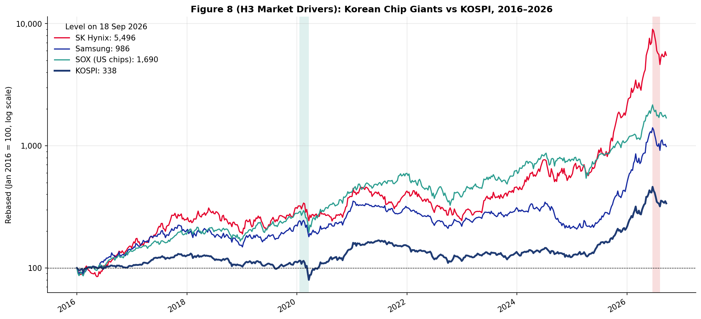

**คำถามของกราฟ:** การเติบโตของ KOSPI ในรอบ 10 ปีมาจากหุ้นกลุ่มใด และเคลื่อนไหวตามวัฏจักรใด

**สิ่งที่กราฟแสดง:** กราฟเส้นมาตราส่วนลอการิทึม ฐานสัปดาห์แรกของปี 2016 = 100 เทียบ KOSPI กับ Samsung, SK Hynix และ SOX

**ข้อสรุปสำคัญ:** ตลอด 10 ปี KOSPI เติบโต 3.4 เท่า ขณะที่ Samsung เติบโต 9.9 เท่า และ SK Hynix เติบโตถึง 55.0 เท่า หุ้นชิปทั้งสองเคลื่อนไหวเกาะวัฏจักรของ SOX ซึ่งเติบโต 16.9 เท่าในช่วงเดียวกัน ช่องว่างนี้คือที่มาของการกระจุกตัวในกราฟถัดไป

> **ข้อควรระวัง:** ราคาปรับการแตกพาร์แล้วแต่ไม่ได้ปรับเงินปันผล ตัวเลขจึงเป็น price return ไม่ใช่ total return | **ที่มา:** yfinance

---

<a id="fig9"></a>
### Figure 9 · การกระจุกตัวของตลาด (CR5) เทียบกับการร่วงของดัชนี

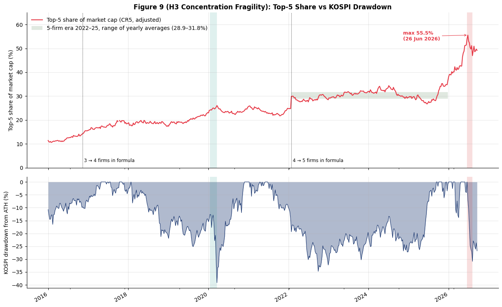

**คำถามของกราฟ:** สัดส่วนของหุ้นขนาดใหญ่สุด 5 ตัวเพิ่มขึ้นจนทำให้ตลาดเปราะบางหรือไม่

**สิ่งที่กราฟแสดง:** แผงบนคือ CR5 แบบปรับตัวหารให้เคลื่อนตามดัชนี พร้อมเส้นระบุจุดที่จำนวนบริษัทในสูตรเปลี่ยน แผงล่างคือระดับการร่วงของ KOSPI จากจุดสูงสุดตลอดกาล

**ข้อสรุปสำคัญ:** จำนวนบริษัทในสูตรไม่คงที่ (3→4→5) การเทียบข้ามยุคจึงต้องระวัง เปรียบเทียบภายในยุค 5 บริษัท: ปี 2022–2025 ค่าเฉลี่ยทรงตัวที่ 28.9–31.8% ติดต่อกัน 4 ปี แต่ปี 2026 กระโดดเป็น 45.8% เฉลี่ย และสูงสุด 55.5% (54.0% ณ วันพีค) โดยจำนวนบริษัทไม่เปลี่ยน → เป็นการกระจุกตัวจริง ไม่ใช่ผลจากวิธีคำนวณ สูงกว่า COVID-19 (24.1%) ถึง 2.2 เท่า

> **ข้อควรระวัง:** ค่าที่ได้เป็นค่าประมาณ เพราะสมมติว่ามูลค่าตลาดรวมเคลื่อนไหวตามดัชนี และใช้จำนวนหุ้นจดทะเบียน ณ วันดึงข้อมูลย้อนหลังทั้งช่วง | **ที่มา:** KRX market-cap snapshot + yfinance

---

<a id="fig10"></a>
### Figure 10 · ความเสียหายกระจุกอยู่ที่ใคร และความผันผวนฉีกตัวหรือไม่

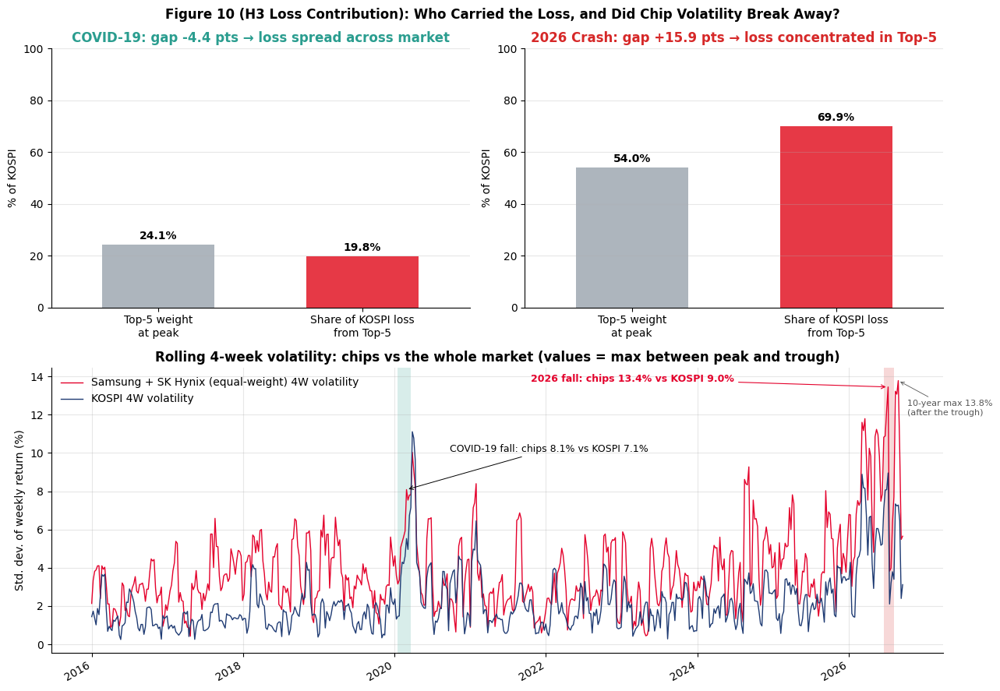

**คำถามของกราฟ:** มูลค่าตลาดที่หายไประหว่างวิกฤตมาจากหุ้นกลุ่มใด และความผันผวนของหุ้นชิปต่างจากตลาดรวมแค่ไหน

**สิ่งที่กราฟแสดง:** แผงบนแยก COVID-19 กับ 2026 เทียบน้ำหนัก Top-5 ณ จุดพีค กับสัดส่วนความเสียหายที่มาจาก Top-5 แผงล่างคือความผันผวน 4 สัปดาห์ของหุ้นชิปเทียบกับ KOSPI (ค่าสูงสุดระหว่างจุดพีคถึงจุดต่ำสุด)

**ข้อสรุปสำคัญ:** COVID-19: Top-5 น้ำหนัก 24.1% สร้างความเสียหาย 19.8% (น้อยกว่าน้ำหนักตัวเอง) 2026: Top-5 น้ำหนัก 54.0% แต่สร้างความเสียหาย 69.9% (สูงกว่า +15.9 จุด) — แรงขายกระจุกที่กลุ่มผู้นำตลาดอย่างผิดสัดส่วน ความผันผวนหุ้นชิปปี 2026 พุ่งถึง 13.4% เทียบตลาดรวม 9.0% ขณะที่ COVID-19 ใกล้เคียงกัน (8.1% vs 7.1%) → ความผันผวนฉีกตัวจากตลาดรวมอย่างชัดเจน

> **ข้อควรระวัง:** สัดส่วนความเสียหายอาศัยสมมติฐานว่ามูลค่าตลาดรวมเคลื่อนไหวตามดัชนี ความผันผวนของหุ้นชิปถ่วงน้ำหนักเท่ากันระหว่าง Samsung และ SK Hynix ไม่ได้ถ่วงตามมูลค่าตลาด | **ที่มา:** KRX market-cap snapshot + yfinance

---

<a id="fig11"></a>
### Figure 11 · วิกฤตโลกหรือวิกฤตเฉพาะเกาหลี

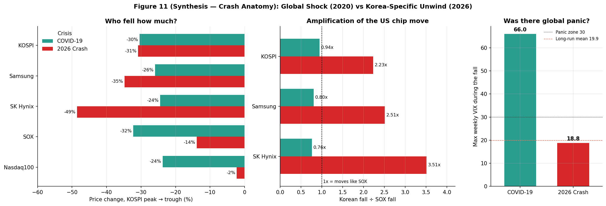

**คำถามของกราฟ:** ปี 2026 เป็นวิกฤตที่เกิดพร้อมกันทั่วโลก หรือเป็นวิกฤตเฉพาะของเกาหลีใต้

**สิ่งที่กราฟแสดง:** สามแผง — การร่วงของสินทรัพย์ 5 ตัวในสองวิกฤต, อัตราขยายแรงเหวี่ยง (การร่วงของหุ้นเกาหลี ÷ การร่วงของ SOX) และ VIX สูงสุดระหว่างการร่วง

**ข้อสรุปสำคัญ:** COVID-19: ทุกตลาดร่วงใกล้เคียงกัน (-23.8% ถึง -32.2%) = การร่วงพร้อมกันทั่วโลก 2026: สหรัฐฯ แทบไม่กระทบ (Nasdaq100 -2.2%, SOX -13.8%) แต่ Samsung -34.7% และ SK Hynix -48.6% อัตราขยายปี 2026: Samsung 2.51 เท่า, SK Hynix 3.51 เท่า เทียบ COVID-19 ที่ 0.76–0.94 เท่า **สรุป:** เป็นการปรับฐานที่เริ่มจากหุ้นชิปสหรัฐฯ แล้วถูกขยายผลอย่างรุนแรงภายในตลาดเกาหลีเอง ไม่ใช่วิกฤตระดับโลก

> **ข้อควรระวัง:** อัตราขยายหารด้วยการร่วงของ SOX ซึ่งมีค่าเพียงราว -14% ตัวหารเล็กทำให้อัตราส่วนพองตัวได้ง่าย ต้องแสดงตัวเลขการร่วงจริงควบคู่กันเสมอ | **ที่มา:** yfinance

---

<a id="fig12"></a>
### Figure 12 · หลักฐานเชิงพฤติกรรมของภาวะ Forced Unwind

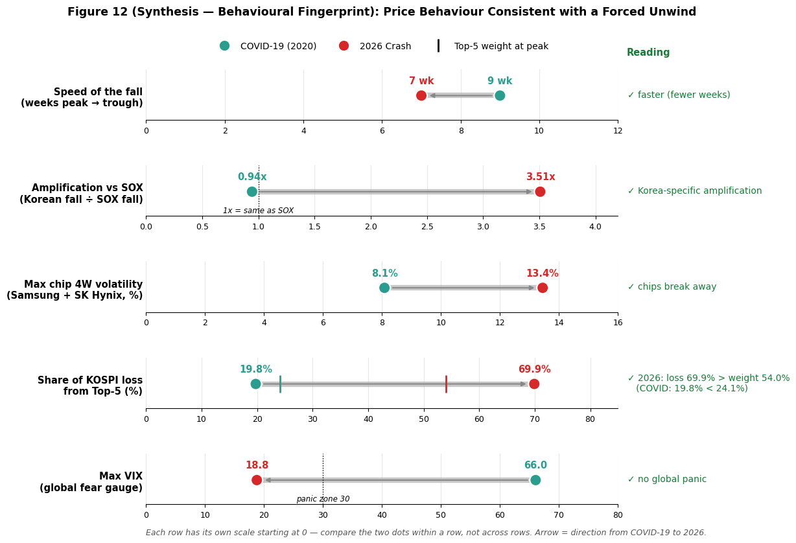

**คำถามของกราฟ:** มีหลักฐานอะไรบ้างที่บ่งชี้ว่าการร่วงครั้งนี้เกิดจากการปิดสถานะแบบถูกบังคับ ทั้งที่ไม่มีข้อมูลหนี้มาร์จิ้นเป็น time series

**สิ่งที่กราฟแสดง:** Dumbbell chart 5 แถว (1 แถวต่อ 1 หลักฐาน) เทียบ COVID-19 (จุดเขียว) กับ 2026 (จุดแดง): ความเร็วในการร่วง, อัตราขยายเทียบ SOX, ความผันผวนหุ้นชิป, สัดส่วนความเสียหายจาก Top-5 และ VIX สูงสุด

**ข้อสรุปสำคัญ:** หลักฐานทั้ง 5 แถวชี้ไปทางเดียวกัน — ร่วงเร็วกว่า (7 เทียบ 9 สัปดาห์), หุ้นกลุ่มเดียวเหวี่ยงแรงกว่าต้นทาง (3.51x เทียบ 0.94x), ความผันผวนหุ้นชิปพุ่งขึ้น (13.4% เทียบ 8.1%), ความเสียหายกระจุกเกินน้ำหนัก (69.9% เทียบน้ำหนัก 54.0%) และทั้งหมดเกิดขึ้นโดยที่ตลาดโลกไม่ตื่นตระหนก (VIX 18.8 เทียบ 66.0) รูปแบบนี้สอดคล้องกับการปิดสถานะแบบถูกบังคับมากกว่าการปรับมุมมองต่อปัจจัยพื้นฐาน

> **คำที่ต้องใช้ในการนำเสนอ:** "ลักษณะพฤติกรรมราคา**สอดคล้องกับ**ภาวะ Forced Unwind" (*consistent with a liquidation cascade*) — **ห้าม**เขียนว่า "เกิดจาก Leverage" หรือ "เกิดจาก Margin Call" เพราะไม่มีชุดข้อมูลรองรับที่ประมวลผลเองได้ | **ที่มา:** คำนวณโดยผู้จัดทำจากตัวแปรในกราฟ 4, 6, 10 และ 11

**หลักฐานภายนอกที่สอดคล้องกับกลไก** (จากรายงานข่าวการเงิน ไม่ใช่ข้อมูลที่ประมวลผลในรายงานนี้): เกาหลีใต้เปิดตัว Single-Stock Leveraged/Inverse ETF บน Samsung และ SK Hynix เป็นครั้งแรก 16 กองทุน เมื่อ 27 พ.ค. 2026 (*The Korea Herald, ETF.com*) กองทุนกลุ่มนี้ต้อง rebalance ทุกวันปิดตลาด เมื่อราคาลงจึงต้องขายหุ้นเพิ่ม (*Bloomberg*) วันที่ร่วงหนักที่สุด (23 มิ.ย. 2026) Samsung -12.31% และ SK Hynix -12.47% (หนักที่สุดตั้งแต่ปี 2008) โดย Bloomberg Intelligence ประเมินแรงขายเชิงกลไกราว 6 พันล้านดอลลาร์ในวันเดียว คิดเป็นราว 14% ของปริมาณซื้อขาย

> **ข้อควรระวัง:** ตัวเลขในส่วนนี้มาจากรายงานข่าว ไม่ใช่ raw data ที่ตรวจสอบเองได้ จึงใช้เป็น**หลักฐานสนับสนุนเชิงบริบท** เท่านั้น ต้องเขียนว่า "ตามรายงานของ..." ทุกครั้ง ไม่ใช้ตัวเลขจำนวนบัญชีที่ถูก Margin Call เพราะแต่ละแหล่งรายงานต่างกันเกือบ 10 เท่า

---

## 📑 แหล่งข้อมูลและข้อจำกัด (Data Sources & Limitations)

| ตัวแปร | แหล่งข้อมูล | สถานะ | ข้อจำกัดที่ตรวจพบ |
|---|---|---|---|
| KOSPI | yfinance | ใช้ได้เต็มที่ | รายสัปดาห์ ถึง 18 ก.ย. 2026 |
| Samsung, SK Hynix | yfinance | ใช้ได้เต็มที่ | ปรับการแตกพาร์แล้วแต่ไม่ปรับเงินปันผล |
| SOX, Nasdaq100, DXY | yfinance | ใช้ได้เต็มที่ | — |
| VIX | yfinance | ใช้ได้ มีเงื่อนไข | ฐานรายสัปดาห์ อาจต่ำกว่าจุดสูงสุดรายวัน |
| ทองคำ (Gold Futures) | yfinance | ใช้ได้ มีเงื่อนไข | เริ่มข้อมูลราวปี 2000 |
| CPI เกาหลี | OECD SDMX | ใช้ได้เต็มที่ | ถึง ส.ค. 2026 |
| Brent, USDKRW | FRED | ใช้ได้เต็มที่ | — |
| อัตราการว่างงาน | FRED | ใช้ได้เต็มที่ | ถึง ก.ค. 2026 |
| OECD CLI | OECD SDMX | ใช้ได้ มีเงื่อนไข | หยุดที่ พ.ค. 2026 (ก่อนจุดพีค 1 เดือน) |
| Real GDP | FRED (รายไตรมาส) | ใช้ได้เต็มที่ | แสดงเป็นรายไตรมาสตามจริง (ไม่ interpolate) · ล่าสุด Q2 2026 · ไตรมาสถัดไปจะมีเมื่อ BOK ประกาศ |
| CR5 (สัดส่วน Top-5) | KRX snapshot + yfinance | ต้องปรับวิธีใช้ | ตัวหารคงที่ ณ วัน snapshot · จำนวนบริษัทในสูตรเปลี่ยน 3→4→5 |
| อัตราดอกเบี้ย | FRED (INTDSRKRM193N) | **ห้ามใช้ระดับ** | เป็น Discount Rate ไม่ใช่ BOK Base Rate ต่ำกว่าความจริงราว 1.5 จุด จึงไม่คำนวณ Real Rate |

---

## 🔬 ระเบียบวิธีวิจัย (Methodology)

1. **ข้อมูล:** ใช้ข้อมูลสองชุด — เศรษฐกิจมหภาครายเดือน และตลาดรายสัปดาห์ ตรึงวันที่ข้อมูลไว้ที่ 18 กันยายน 2026 เพื่อให้ผลลัพธ์ทำซ้ำได้
2. **การเตรียมข้อมูล:** เติมราคาในสัปดาห์ที่ตลาดปิดด้วยค่าล่าสุด (ไม่เกิน 2 สัปดาห์), คำนวณผลตอบแทนรายสัปดาห์และความผันผวน 4 สัปดาห์ (SD ของผลตอบแทน), คำนวณระดับการร่วงของ KOSPI จากจุดสูงสุดตลอดกาล, ปรับตัวหาร CR5 ให้เคลื่อนตามดัชนีแทนมูลค่าตลาดรวม ณ วันเดียว, คำนวณ YoY ของ CPI, GDP, ราคาน้ำมันในสกุลวอน และ Z-score 36 เดือนของ USDKRW
3. **การกำหนดช่วงวิกฤต:** ไม่ใช้วันที่ตั้งเอง แต่หาจุดสูงสุดของ KOSPI ภายในหน้าต่างก่อนวิกฤต แล้วหาจุดต่ำสุดหลังจากนั้น และนับจำนวนสัปดาห์ที่ใช้ฟื้นกลับจุดเดิม
4. **หลักการเขียนคำอธิบาย:** ตัวเลขทุกตัวคำนวณจากข้อมูลจริงโดยตรง แต่ละกราฟอธิบายตามลำดับ คำถามของกราฟ → สิ่งที่กราฟแสดง → การตีความ → ข้อควรระวังและที่มา

---

## ✅ สรุปผลตามสมมติฐาน (Findings by Hypothesis)

| สมมติฐาน | หลักฐานจากข้อมูล | ผล |
|---|---|---|
| **H1** เศรษฐกิจชะลอพร้อมเงินเฟ้อสูง | สัญญาณ Stagflation 12 เดือนก่อนพีค = 0 เดือนทุกวิกฤต · CLI พ.ค. 2026 = 100.44 · Brent +54% ใน 1 เดือน, CPI ทะลุ 3% ภายในไม่กี่เดือน (r ≈ 0.50–0.52 ที่ lag 1–7 เดือน), ดอกเบี้ยไม่เปลี่ยน | **สนับสนุนบางส่วน:** มีแรงกดดันจากต้นทุน แต่ไม่มีภาวะ Stagflation |
| **H2** ความตื่นตระหนกระดับโลก / ค่าเงิน | VIX สูงสุด 18.8 (< ค่าเฉลี่ย 19.9) · ทองคำชะลอจาก +84.2% เหลือ +24.6% · หลังค่าเงินทะลุกรอบ KOSPI เดือนถัดไป median +3.31% (n = 25) ไม่ต่างจากปกติ | **ไม่สนับสนุน:** ทั้งความตื่นตระหนกและค่าเงินไม่ใช่ตัวจุดชนวน |
| **H3** ความเปราะบางจากการกระจุกตัว | CR5 ทรงตัว 28.9–31.8% (2022–25) → 45.8% ในปี 2026 สูงสุด 55.5% · Top-5 สร้างความเสียหาย 69.9% เทียบน้ำหนัก 54.0% | **สนับสนุน:** หลักฐานแข็งแรงที่สุด |
| **H4** การส่งผ่านจากหุ้นเทคสหรัฐฯ | r กับ SOX = 0.59, Nasdaq100 = 0.51 · SOX -13.8% แต่ SK Hynix -48.6% (ขยาย 3.51x) | **สนับสนุนฝั่งการส่งผ่าน:** ฝั่งการปรับลดมูลค่า (Valuation) ยังสรุปไม่ได้ เพราะไม่มีข้อมูลกำไรต่อหุ้น |

---

## ⚠️ ข้อจำกัดของข้อมูลและงานในอนาคต (Limitations & Future Work)

**ข้อจำกัดหลัก:** ไม่สามารถเข้าถึงข้อมูลสินเชื่อมาร์จิ้นรายวัน (Margin Loan Balance จาก KRX/KOFIA) เป็น time series ผ่าน Public API จึงใช้ร่องรอยเชิงพฤติกรรม (Figure 12) เป็นตัวแทน · อัตราดอกเบี้ยที่มีเป็น Discount Rate ไม่ใช่ BOK Base Rate · CR5 ใช้จำนวนหุ้นจดทะเบียน ณ วันดึงข้อมูลย้อนหลังทั้งช่วง · GDP เป็นข้อมูลรายไตรมาสโดยธรรมชาติ ไตรมาสล่าสุดคือ Q2 2026 · ความสัมพันธ์ที่พบทั้งหมดเป็นเชิงสถิติ ไม่ได้พิสูจน์ความเป็นเหตุเป็นผล

**งานในอนาคต:** ยืนยัน Forced Unwind โดยตรงด้วยข้อมูล Margin Balance รายวัน (KOFIA) และ AUM/flow ของ Single-Stock Leveraged ETF, เปลี่ยนไปใช้ BOK Base Rate จากระบบ ECOS เพื่อคำนวณ Real Rate, เพิ่มข้อมูล EPS/Forward P/E เพื่อแยกผลจาก Valuation, พัฒนา Early Warning System จากข้อมูลรายวันร่วมกับ CR5 และขนาด AUM ของ Leveraged ETF, และคำนวณ Herfindahl-Hirschman Index (HHI) ควบคู่กับ CR5 เพื่อยืนยันผลด้วยตัวชี้วัดมาตรฐานอีกตัว

---

## 📁 โครงสร้างคลังรหัส (Repository Structure)

> โครงสร้างด้านล่างเป็นตัวอย่างสำหรับจัดวางไฟล์ในคลังรหัสนี้ — โปรดแก้ชื่อสคริปต์/ไฟล์ข้อมูลให้ตรงกับไฟล์จริงที่ใช้สร้างกราฟทั้ง 12 ภาพ

```
korea-crash-2026/
├── README.md                          # เอกสารฉบับนี้
├── fig1_macro_overview.png            # Figure 1: ภาพรวมเศรษฐกิจมหภาค 2000-2026
├── fig2_cli_vs_cpi.png                # Figure 2: ดัชนีชี้นำเศรษฐกิจเทียบกับเงินเฟ้อ
├── fig3_oil_cpi_transmission.png      # Figure 3: แรงกดดันเงินเฟ้อจากฝั่งต้นทุนน้ำมัน
├── fig4_vix_gold.png                  # Figure 4: ความกลัวของตลาดโลกและสินทรัพย์ปลอดภัย
├── fig5_usdkrw_signal.png             # Figure 5: ค่าเงินวอนเป็นสัญญาณเตือนได้หรือไม่
├── fig6_crisis_comparison.png         # Figure 6: เปรียบเทียบความเร็วและความลึกของการร่วง
├── fig7_correlation_ranking.png       # Figure 7: ปัจจัยที่เคลื่อนไหวไปพร้อมกับ KOSPI
├── fig8_chip_growth.png               # Figure 8: ผู้ลากดัชนีตลอด 10 ปี
├── fig9_cr5_concentration.png         # Figure 9: การกระจุกตัวของตลาด (CR5)
├── fig10_damage_concentration.png     # Figure 10: ความเสียหายกระจุกตัวและความผันผวนฉีกตัว
├── fig11_global_vs_korea.png          # Figure 11: วิกฤตโลกหรือวิกฤตเฉพาะเกาหลี
├── fig12_forced_unwind_evidence.png   # Figure 12: หลักฐาน Forced Unwind
├── Korea_Crash_Visualization_CSV.ipynb  # Notebook วิเคราะห์และสร้างกราฟทั้งหมด (เปิดผ่าน Colab)
└── data/
    ├── macro_monthly.csv              # ข้อมูลเศรษฐกิจมหภาครายเดือน (GDP, CPI, CLI, USDKRW)
    └── weekly_full.csv                # ข้อมูลตลาดรายสัปดาห์ (ราคาหุ้น ดัชนี VIX ทองคำ CR5)
```

> Notebook อ่านข้อมูลจากไฟล์ `.csv` ใน `data/` ไม่ได้ดึงสดจาก API ทุกครั้งที่รัน ทำให้ผลลัพธ์ทำซ้ำได้เหมือนเดิมเสมอ

---

## 🚀 วิธีการรันและการประมวลผลซ้ำ (How to Run & Reproduce)

การวิเคราะห์ทั้งหมดอยู่ใน **`Korea_Crash_Visualization_CSV.ipynb`** และรันผ่าน **Google Colab** ไม่ต้องติดตั้งอะไรในเครื่องก่อน

### 1. เปิด Notebook ผ่าน Colab

กดปุ่ม **"Open in Colab"** ด้านบนสุดของเอกสารนี้ หรือเปิดลิงก์โดยตรง:

```
https://colab.research.google.com/github/atawuttecha/korea-crash-2026/blob/main/Korea_Crash_Visualization_CSV.ipynb
```

> Colab จะดึงไฟล์ `.ipynb` ตรงจาก GitHub repo นี้เสมอ (ไม่ใช่สำเนาที่บันทึกแยกไว้) จึงควร commit เวอร์ชันล่าสุดขึ้น GitHub ก่อนแชร์ลิงก์

### 2. ไม่ต้องติดตั้งแพ็กเกจเพิ่ม

Notebook ใช้เฉพาะ pandas, numpy และ matplotlib ซึ่ง Colab ติดตั้งมาให้แล้ว และอ่านข้อมูลจากไฟล์ `.csv` ใน `data/` ของ repo นี้โดยตรง จึงไม่ต้องใช้ `yfinance` หรือ API key ใดๆ

### 3. รันทุกเซลล์ตามลำดับ (Runtime → Run all)

Notebook จะสร้างกราฟทั้ง 12 ภาพใหม่ และบันทึกลงโฟลเดอร์ `figures/` ในเซสชันโดยอัตโนมัติ ด้วยชื่อไฟล์เดียวกับที่ README อ้างอิง

### 4. ดาวน์โหลดกราฟกลับมาใส่ repo (ถ้าต้องการอัปเดต README)

รูปที่สร้างในเซสชัน Colab จะ**หายไปเมื่อปิดเซสชัน** เพราะเป็นพื้นที่ชั่วคราว ถ้าต้องการอัปเดตรูปใน repo ให้ดาวน์โหลดทั้งโฟลเดอร์ออกมาแล้ว commit ทับไฟล์เดิมที่ root ของ repo:

```python
import shutil
from google.colab import files
shutil.make_archive('figures', 'zip', 'figures')
files.download('figures.zip')
```

> **ข้อควรระวัง:** เส้นทางไฟล์ (path) ในสภาพแวดล้อม Colab เช่น `/content/...` ใช้ได้เฉพาะระหว่างรันเซสชันเท่านั้น ไม่เกี่ยวกับ path ที่ README อ้างอิงบน GitHub (`./fig1_macro_overview.png`) ทั้งสองระบบแยกจากกัน ต้องดาวน์โหลด/อัปโหลดไฟล์ข้ามระหว่างกันเองเสมอ

---

## 📜 การอนุญาตและการอ้างอิง (License & Citation)

โครงการนี้จัดทำขึ้นเพื่อการศึกษาเชิงประจักษ์ด้านเศรษฐศาสตร์มหภาคและโครงสร้างตลาดทุน (DADS5001 Mini-Project) ตัวเลขทุกตัวคำนวณจากข้อมูลจริง ณ วันที่ 18 กันยายน 2026 ผู้สนใจสามารถนำไปใช้งาน ดัดแปลง หรือพัฒนาต่อยอดได้พร้อมการอ้างอิงที่เหมาะสม
