# Korea Crash 2026: การตรวจสอบเศรษฐกิจมหภาคและการคลายตัวของการกระจุกหุ้นเทคโนโลยี (Macro Check + Tech Concentration Unwind)

[](https://www.python.org/)
[](https://pandas.pydata.org/)
[](https://matplotlib.org/)
[-orange.svg)](#)
[](#)
[](https://colab.research.google.com/github/atawuttecha/korea-crash-2026/blob/main/Korea_Crash_Visualization_CSV.ipynb)

> **การศึกษาเชิงประจักษ์ด้านวิทยาการข้อมูล (Empirical Data Science) เพื่อตรวจสอบสาเหตุเบื้องหลังการร่วงของดัชนี KOSPI ในปี 2026 โดยไล่ระดับจากภาพเศรษฐกิจมหภาค (Macro) ความตื่นตระหนกของตลาดโลก (Global Risk-Off) ไปจนถึงโครงสร้างการกระจุกตัวของตลาดหุ้นภายในประเทศ (Market Concentration) และร่องรอยเชิงพฤติกรรมของการปิดสถานะแบบถูกบังคับ (Forced Unwind)**

---

## 📋 Executive Summary

การร่วงของดัชนี KOSPI ในปี 2026 เกิดขึ้นอย่างรวดเร็วและรุนแรง แต่ไม่ปรากฏสัญญาณเตือนล่วงหน้าทั้งจากภาวะเศรษฐกิจถดถอย (Stagflation) และความตื่นตระหนกของตลาดการเงินโลก โครงการนี้ทดสอบสมมติฐาน 4 ข้อ (H1–H4) ด้วยข้อมูลเศรษฐกิจมหภาครายเดือนและข้อมูลตลาดรายสัปดาห์ ครอบคลุมช่วงเวลา 26 ปี (2000–2026) เปรียบเทียบกับวิกฤต Dot-com (2000), Global Financial Crisis (2008) และ COVID-19 (2020) โดยตรึงวันที่ข้อมูลไว้ที่ **18 กันยายน 2026** เพื่อให้ผลลัพธ์ทำซ้ำได้

### 🌟 สรุปผลลัพธ์สำคัญ (Key Findings)

1. **เศรษฐกิจจริงไม่ได้พัง:** อัตราการว่างงานเดือนมิถุนายนอยู่ที่ **2.75%** (กรกฎาคม 2.80%) และดัชนีชี้นำเศรษฐกิจ OECD CLI เดือนพฤษภาคมยังอยู่เหนือระดับ 100 ที่ **100.44** ไม่มีสัญญาณ Stagflation ในช่วง 12 เดือนก่อนจุดพีคของทั้ง 4 วิกฤต
2. **ตลาดโลกไม่ตื่นตระหนก:** VIX สูงสุดระหว่างการร่วงอยู่ที่เพียง **18.8** ต่ำกว่าค่าเฉลี่ยระยะยาว (19.9) เทียบกับ Dot-com (42.7) GFC (79.1) และ COVID-19 (66.0) และทองคำ YoY กลับ **ชะลอตัวลง** จาก +84.2% เหลือ +24.6% ระหว่างวิกฤต
3. **ความเสียหายกระจุกตัวผิดสัดส่วน:** หุ้น 5 อันดับแรก (CR5) มีน้ำหนักในดัชนี **54.0%** ณ จุดพีค แต่สร้างความเสียหายถึง **69.9%** ของมูลค่าตลาดที่หายไป (สูงกว่าน้ำหนักตัวเอง +15.9 จุด) ตรงข้ามกับ COVID-19 ที่ความเสียหายต่ำกว่าน้ำหนักตัวเอง
4. **ความเร็วผิดปกติ:** ดัชนีร่วง **-30.9% ภายใน 7 สัปดาห์** อัตราเฉลี่ย 4.4% ต่อสัปดาห์ ซึ่งเร็วที่สุดในบรรดา 4 วิกฤตที่ศึกษา (เร็วกว่า Dot-com และ GFC ราว 7–13 เท่า)
5. **แรงส่งจากหุ้นชิปสหรัฐฯ ถูกขยายผลในประเทศ:** Samsung และ SK Hynix ร่วง **2.51 เท่า** และ **3.51 เท่า** ของการร่วงของดัชนี SOX (สหรัฐฯ) ตามลำดับ ขณะที่ Nasdaq100 แทบไม่กระทบ (-2.2%)

**ข้อสรุปโดยรวม:** รูปแบบราคาสอดคล้องกับ **การปรับฐานของกลุ่มเซมิคอนดักเตอร์ที่ถูกขยายผลโดยโครงสร้างตลาดที่กระจุกตัว (consistent with a liquidation cascade)** มากกว่าวิกฤตเศรษฐกิจมหภาคหรือความตื่นตระหนกระดับโลก

---

## สารบัญ (Table of Contents)

- [นิยามศัพท์เฉพาะ (Definition of Terms)](#-นิยามศัพท์เฉพาะ-definition-of-terms)
- [สมมติฐานการวิจัย (Research Hypotheses)](#-สมมติฐานการวิจัย-research-hypotheses)
- [ตารางเปรียบเทียบ 4 วิกฤต (Comparative Crisis Summary)](#-ตารางเปรียบเทียบ-4-วิกฤต-comparative-crisis-summary)
- [รูปภาพและบทวิเคราะห์เชิงลึก (Visual Gallery & Analytical Insights)](#รูปภาพและบทวิเคราะห์เชิงลึก-visual-gallery--analytical-insights)
  * [Figure 1: ภาพรวมเศรษฐกิจมหภาค 2000–2026](#fig1)
  * [Figure 2: ดัชนีชี้นำเศรษฐกิจเทียบกับเงินเฟ้อ (Stagflation Check)](#fig2)
  * [Figure 3: แรงกดดันเงินเฟ้อจากฝั่งต้นทุนน้ำมัน](#fig3)
  * [Figure 4: ความกลัวของตลาดโลกและสินทรัพย์ปลอดภัย](#fig4)
  * [Figure 5: ค่าเงินวอนเป็นสัญญาณเตือนได้หรือไม่](#fig5)
  * [Figure 6: เปรียบเทียบความเร็วและความลึกของการร่วง](#fig6)
  * [Figure 7: ปัจจัยที่เคลื่อนไหวไปพร้อมกับ KOSPI มากที่สุด](#fig7)
  * [Figure 8: ใครคือผู้ลากดัชนีตลอด 10 ปี](#fig8)
  * [Figure 9: การกระจุกตัวของตลาด (CR5) เทียบกับการร่วงของดัชนี](#fig9)
  * [Figure 10: ความเสียหายกระจุกอยู่ที่ใคร และความผันผวนฉีกตัวหรือไม่](#fig10)
  * [Figure 11: วิกฤตโลกหรือวิกฤตเฉพาะเกาหลี](#fig11)
  * [Figure 12: หลักฐานเชิงพฤติกรรมของภาวะ Forced Unwind](#fig12)
- [แหล่งข้อมูลและข้อจำกัด (Data Sources & Limitations)](#-แหล่งข้อมูลและข้อจำกัด-data-sources--limitations)
- [ระเบียบวิธีวิจัย (Methodology)](#-ระเบียบวิธีวิจัย-methodology)
- [สรุปผลตามสมมติฐาน (Findings by Hypothesis)](#-สรุปผลตามสมมติฐาน-findings-by-hypothesis)
- [ข้อจำกัดของข้อมูลและงานในอนาคต (Limitations & Future Work)](#-ข้อจำกัดของข้อมูลและงานในอนาคต-limitations--future-work)
- [โครงสร้างคลังรหัส (Repository Structure)](#-โครงสร้างคลังรหัส-repository-structure)
- [วิธีการรันและการประมวลผลซ้ำ (How to Run & Reproduce)](#-วิธีการรันและการประมวลผลซ้ำ-how-to-run--reproduce)
- [การอนุญาตและการอ้างอิง (License & Citation)](#-การอนุญาตและการอ้างอิง-license--citation)

---

## 📘 นิยามศัพท์เฉพาะ (Definition of Terms)

| คำศัพท์ | คำอธิบาย |
|---|---|
| **KOSPI** | ดัชนีตลาดหลักทรัพย์รวมของเกาหลีใต้ (Korea Composite Stock Price Index) |
| **OECD CLI (Composite Leading Indicator)** | ดัชนีชี้นำเศรษฐกิจ ใช้คาดการณ์จุดเปลี่ยนของวัฏจักรเศรษฐกิจ ค่าเหนือ 100 หมายถึงแนวโน้มขยายตัว |
| **Stagflation** | ภาวะเศรษฐกิจชะลอตัวพร้อมเงินเฟ้อสูง ในรายงานนี้กำหนดเกณฑ์เป็น CLI < 100 และ CPI > 3% พร้อมกัน |
| **VIX** | ดัชนีวัดความผันผวนคาดการณ์ของตลาดหุ้นสหรัฐฯ (CBOE Volatility Index) ใช้เป็นตัวชี้วัดความกลัวของตลาดโลก |
| **CR5 (Concentration Ratio-5)** | สัดส่วนมูลค่าตลาดของหุ้น 5 อันดับแรกเทียบกับมูลค่าตลาดรวมทั้งดัชนี ใช้วัดการกระจุกตัว |
| **Z-score** | ค่ามาตรฐานที่วัดระยะห่างของค่าสังเกตจากค่าเฉลี่ยเป็นหน่วยส่วนเบี่ยงเบนมาตรฐาน ใช้ตรวจจับความผิดปกติของค่าเงิน |
| **Forced Unwind / Liquidation Cascade** | ภาวะที่นักลงทุนถูกบังคับปิดสถานะ (เช่นจาก Margin Call หรือการ rebalance ของ Leveraged ETF) ก่อให้เกิดแรงขายต่อเนื่อง |
| **Leveraged ETF** | กองทุนที่ให้ผลตอบแทนทวีคูณ (เช่น 2 เท่า) ของหุ้นอ้างอิงในแต่ละวัน ต้อง rebalance ทุกวันปิดตลาด |
| **Pass-Through / Transmission Lag** | ระยะเวลาและขนาดที่ตัวแปรต้นทาง (เช่นราคาน้ำมัน) ส่งผลไปยังตัวแปรปลายทาง (เช่นเงินเฟ้อ) |
| **Discount Rate vs. BOK Base Rate** | อัตราคิดลดที่ใช้แทนอัตราดอกเบี้ยนโยบายในชุดข้อมูล FRED (INTDSRKRM193N) ซึ่งต่ำกว่าอัตราดอกเบี้ยนโยบายจริงของธนาคารกลางเกาหลีราว 1.5 จุด |

---

## 🎯 สมมติฐานการวิจัย (Research Hypotheses)

**คำถามวิจัยหลัก:** การร่วงของดัชนี KOSPI ในปี 2026 มีสาเหตุมาจากปัจจัยมหภาค ความตื่นตระหนกระดับโลก หรือโครงสร้างตลาดภายในประเทศ?

- **H1 — เศรษฐกิจชะลอตัวพร้อมเงินเฟ้อสูง (Stagflation):** มีสัญญาณ Stagflation ก่อตัวก่อนวิกฤตหรือไม่ และเงินเฟ้อที่ขยับขึ้นมาจากราคาน้ำมันหรือไม่
- **H2 — ความตื่นตระหนกระดับโลก / ค่าเงิน:** ความกลัวของตลาดการเงินโลก (VIX) หรือค่าเงินวอนที่อ่อนตัวเป็นตัวจุดชนวนหรือไม่
- **H3 — ความเปราะบางจากการกระจุกตัวของตลาด:** ดัชนี KOSPI พึ่งพาหุ้นกลุ่มเซมิคอนดักเตอร์มากเกินไปจนเปราะบางหรือไม่
- **H4 — การส่งผ่านจากหุ้นเทคสหรัฐฯ:** แรงกระแทกจากหุ้นชิปสหรัฐฯ ส่งผ่านมาและถูกขยายผลภายในตลาดเกาหลีหรือไม่

---

## 📊 ตารางเปรียบเทียบ 4 วิกฤต (Comparative Crisis Summary)

| ตัวชี้วัด | Dot-com (2000) | GFC (2008) | COVID-19 (2020) | Korea Crash 2026 |
|---|---|---|---|---|
| **ความลึกของการร่วง (Peak-to-Trough)** | -54.1% | -53.7% | **-30.4%** | **-30.9%** |
| **ระยะเวลาร่วง (สัปดาห์)** | 90 | 52 | 9 | **7** |
| **อัตราการร่วงเฉลี่ยต่อสัปดาห์** | 0.6% | 1.0% | 3.4% | **4.4%** (สูงสุด) |
| **VIX สูงสุด** | 42.7 | 79.1 | 66.0 | **18.8** (ต่ำสุด) |
| **CR5 ณ จุดพีค** | — | — | 24.1% | **54.0%** |
| **สัดส่วนความเสียหายจาก Top-5** | — | — | 19.8% (ต่ำกว่าน้ำหนัก) | **69.9%** (สูงกว่าน้ำหนัก) |
| **สัญญาณ Stagflation ก่อนพีค (เดือน)** | 0 | 0 | 0 | **0** |

> หมายเหตุ: ช่อง (—) คือตัวชี้วัดที่คำนวณเฉพาะ COVID-19 และ 2026 (CR5 และสัดส่วนความเสียหาย) เพื่อใช้เป็นกรณีเทียบเคียงหลัก

---

## รูปภาพและบทวิเคราะห์เชิงลึก (Visual Gallery & Analytical Insights)

### 🧭 เส้นเรื่องของการวิเคราะห์

กราฟทั้ง 12 ภาพเรียงตามหลัก **"ตัดสาเหตุทีละชั้น จากกว้างไปแคบ"** แต่ละกราฟตอบคำถามหนึ่งข้อ และคำตอบนั้นนำไปสู่คำถามของกราฟถัดไป

| ช่วง | กราฟ | คำถามหลัก | คำตอบโดยย่อ |
|---|---|---|---|
| **1. เศรษฐกิจในประเทศ (H1)** | Fig 1–3 | เศรษฐกิจจริงพังหรือมี Stagflation ก่อนตลาดร่วงหรือไม่ | ไม่พัง ไม่มี Stagflation มีเพียงเงินเฟ้อจากราคาน้ำมัน |
| **2. ปัจจัยภายนอก (H2)** | Fig 4–5 | ตลาดโลกตื่นตระหนก หรือค่าเงินวอนเป็นตัวจุดชนวนหรือไม่ | ไม่ใช่ทั้งสองอย่าง |
| **3. ลักษณะของการร่วง** | Fig 6–7 | การร่วงครั้งนี้ต่างจากวิกฤตอื่นอย่างไร และ KOSPI เคลื่อนไหวตามอะไร | เร็วที่สุดใน 4 วิกฤต และเคลื่อนไหวตามหุ้นชิปมากที่สุด |
| **4. โครงสร้างตลาด (H3)** | Fig 8–10 | หุ้นชิปใหญ่จนตลาดเปราะบาง และความเสียหายกระจุกที่หุ้นกลุ่มนี้หรือไม่ | ใช่ การกระจุกตัวสูงสุดพอดีกับจุดพีค และความเสียหายเกินน้ำหนักของตัวเอง |
| **5. ต้นทางและกลไก (H4)** | Fig 11–12 | แรงกระแทกมาจากไหน และถูกขยายผลด้วยกลไกอะไร | เริ่มจากหุ้นชิปสหรัฐฯ แล้วถูกขยายผลในเกาหลี รูปแบบสอดคล้องกับ Forced Unwind |

> **หมายเหตุการอ่านกราฟ:** ใน Figure 1–3 **วงกลมสีม่วง** ใช้ชี้จุดที่ต้องสังเกตเป็นพิเศษ (เช่น จุดพีคของดัชนี ค่าล่าสุดของ GDP เดือนที่ใช้ตรวจ Stagflation และจุดที่ราคาน้ำมันกระโดด) **แถบสีจาง** คลุมช่วงพีคถึงจุดต่ำสุดของแต่ละวิกฤตด้วยสีเดียวกันทุกกราฟ และมุมซ้ายบนของแต่ละแผงระบุความถี่ของข้อมูล (weekly / monthly / quarterly)

<a id="fig1"></a>
### Figure 1 · ภาพรวมเศรษฐกิจมหภาค 2000–2026

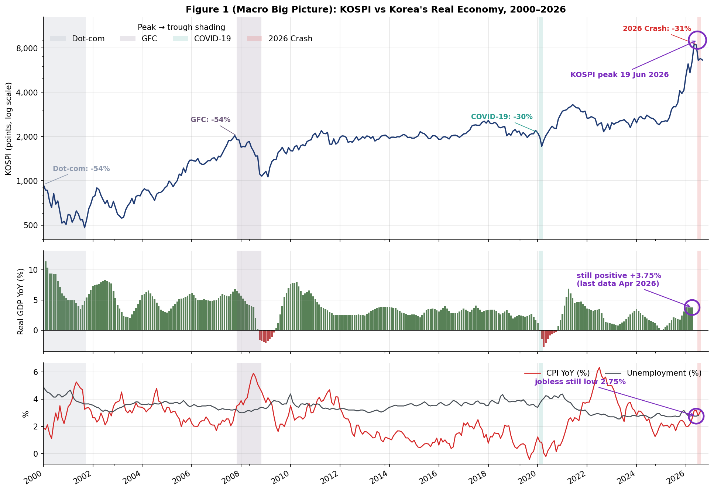

**คำถามของกราฟ:** วิกฤตปี 2026 เกิดขึ้นพร้อมกับการพังทลายของเศรษฐกิจจริงเหมือน 3 วิกฤตในอดีตหรือไม่

**สิ่งที่กราฟแสดง:** สามแผงบนแกนเวลาเดียวกัน (2000–2026) แต่ละแผงใช้ความถี่จริงของข้อมูล ระบุไว้ที่มุมซ้ายบนของแผง

*แผงบน: ดัชนี KOSPI รายสัปดาห์*
- แกนตั้งเป็น**มาตราส่วนลอการิทึม** ระยะห่างเท่ากันแทน % การเปลี่ยนแปลงที่เท่ากัน เช่น 500 → 1,000 สูงเท่ากับ 4,000 → 8,000 เพราะเพิ่มขึ้น 100% เท่ากัน จึงเทียบความรุนแรงของการร่วงข้ามยุคได้ยุติธรรม แม้ดัชนีปี 2026 จะอยู่สูงกว่าปี 2000 หลายเท่า
- **แถบสีจาง 4 สี** คลุมช่วงจากจุดพีคถึงจุดต่ำสุดของแต่ละวิกฤต (Dot-com สีเทา, GFC สีม่วงเทา, COVID-19 สีเขียวอมฟ้า, 2026 สีแดง) ใช้สีชุดนี้ในทุกกราฟ
- **ลูกศรพร้อมตัวเลข %** ชี้ที่จุดต่ำสุดของแต่ละวิกฤต บอกว่าดัชนีร่วงจากพีคไปเท่าไร (Dot-com −54%, GFC −54%, COVID-19 −30%, 2026 −31%)
- **วงกลมสีม่วง** ชี้จุดพีคของปี 2026 (19 มิ.ย. 2026)

*แผงกลาง: Real GDP YoY รายไตรมาส*
- 1 แท่ง = 1 ไตรมาสที่ BOK ประกาศจริง ความกว้างของแท่งครอบคลุมทั้งไตรมาส
- **แท่งสีเขียว** คือไตรมาสที่เศรษฐกิจโตกว่าไตรมาสเดียวกันของปีก่อน **แท่งสีแดง** คือไตรมาสที่หดตัว (YoY ติดลบ) ซึ่งเกิดเพียง 3 ช่วง: GFC (Q4 2008 – Q2 2009), COVID-19 (Q2–Q4 2020) และ Q1 2025 (−0.03% แท่งจึงเตี้ยจนแทบมองไม่เห็น)
- **วงกลมสีม่วง** ชี้ไตรมาสล่าสุดที่ประกาศ (Q2 2026: +3.75%)

*แผงล่าง: เงินเฟ้อและอัตราการว่างงาน รายเดือน*
- **เส้นสีแดง** คือ CPI YoY (อัตราเงินเฟ้อ) **เส้นสีเทาเข้ม** คืออัตราการว่างงาน หน่วยเป็น % ทั้งคู่
- **วงกลมสีม่วง** ชี้อัตราการว่างงานเดือนที่เกิดจุดพีค (มิ.ย. 2026: 2.75%)

**ข้อสรุปสำคัญ:**
- **วิกฤตในอดีต:** GFC และ COVID-19 มีแท่ง GDP สีแดงอยู่ติดกับแถบวิกฤต ตลาดร่วงพร้อมเศรษฐกิจหดตัว ส่วน Dot-com GDP ยังโต แต่ชะลอลงจากราว 6–12% ในปี 2000 เหลือราว 3.5–5.4% ในปี 2001
- **ปี 2026:** ไม่มีแท่งสีแดง GDP ล่าสุด (Q2 2026) ยังโต +3.75% อัตราการว่างงานอยู่ที่ 2.75% (มิ.ย.) และ 2.80% (ก.ค.) เงินเฟ้ออยู่ที่ 3.16% และ 2.79% ตามลำดับ ใกล้เคียงระดับปกติ
- **สรุป:** ตลาดร่วง 31% ทั้งที่เศรษฐกิจจริงยังขยายตัว การร่วงปี 2026 จึงไม่มีลักษณะของวิกฤตเศรษฐกิจมหภาคภายในประเทศ

> **ข้อควรระวัง:** GDP แสดงเป็นรายไตรมาสตามความถี่จริง (ไม่ประมาณค่ารายเดือน) แท่งสุดท้ายคือ Q2 2026 ซึ่งเป็นไตรมาสล่าสุดที่ BOK ประกาศ ณ วันดึงข้อมูล ไม่ใช่ ณ วันเกิดเหตุ เพราะ Q3 2026 ยังไม่จบ | **ที่มา:** KOSPI (yfinance) · Real GDP (FRED) · CPI (OECD SDMX) · Unemployment (FRED)

---

<a id="fig2"></a>
### Figure 2 · ดัชนีชี้นำเศรษฐกิจเทียบกับเงินเฟ้อ (Stagflation Check)

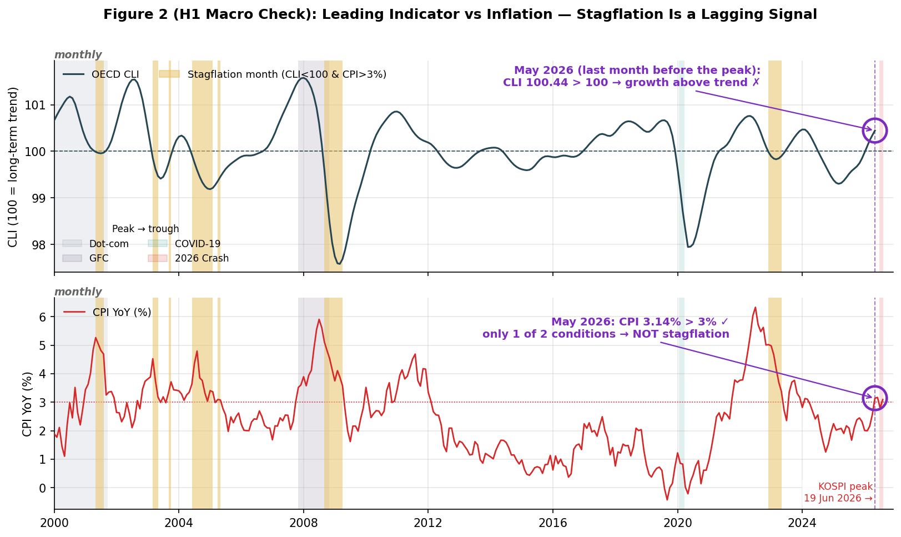

**คำถามของกราฟ:** ก่อนเกิดวิกฤต มีสัญญาณ Stagflation ก่อตัวขึ้นหรือไม่

**สิ่งที่กราฟแสดง:** สองแผงซ้อนกันบนแกนเวลาเดียวกัน (รายเดือน 2000–2026)

*แผงบน: OECD CLI (ดัชนีชี้นำเศรษฐกิจ)*
- **เส้นสีเขียวเข้ม** คือค่า CLI **เส้นประที่ 100** คือแนวโน้มระยะยาว ค่าเหนือ 100 หมายถึงเศรษฐกิจขยายตัวเหนือแนวโน้ม ต่ำกว่า 100 หมายถึงกำลังชะลอตัว
- CLI มีข้อมูลถึง พ.ค. 2026 เส้นจึงจบก่อนเส้นในแผงล่าง

*แผงล่าง: CPI YoY (อัตราเงินเฟ้อ)*
- **เส้นสีแดง** คืออัตราเงินเฟ้อ **เส้นจุดที่ 3%** คือเกณฑ์เฝ้าระวังเงินเฟ้อสูง

*องค์ประกอบที่ใช้ร่วมกันทั้งสองแผง*
- **แถบสีทอง** คือเดือนที่เข้าเงื่อนไข Stagflation ครบทั้งสองข้อในเดือนเดียวกัน (CLI < 100 และ CPI > 3%) ระบายตรงกันทั้งสองแผง
- **แถบสีจาง** คือช่วงพีคถึงจุดต่ำสุดของ 4 วิกฤต ใช้สีเดียวกับ Figure 1
- **วงกลมและเส้นประสีม่วง** ชี้เดือน พ.ค. 2026 ในทั้งสองแผง ซึ่งเป็นเดือนเต็มสุดท้ายก่อนจุดพีคของ KOSPI (19 มิ.ย. 2026) เพราะ Stagflation ต้องเข้าทั้งสองเงื่อนไข**ในเดือนเดียวกัน** และต้องเกิด**ก่อน**ตลาดร่วงจึงจะนับเป็นสาเหตุได้ ป้าย ✓ / ✗ บอกว่าแต่ละเงื่อนไขผ่านหรือไม่
- แยกเป็นสองแผงแทนกราฟสองแกน Y เพราะสองแกนที่ตั้งสเกลแยกกันทำให้ตำแหน่งที่เส้นตัดกันไม่มีความหมายทางสถิติ

**ข้อสรุปสำคัญ:**
- **Stagflation เป็นตัวชี้วัดตามหลัง:** ไม่มีวิกฤตใดใน 4 ครั้งที่เกิดสัญญาณ Stagflation ในช่วง 12 เดือนก่อนจุดพีค (ทุกวิกฤต = 0 เดือน) แถบสีทองในปี 2001 และ 2008 เกิดขึ้น**ระหว่าง**ที่ตลาดกำลังร่วงหรือหลังจากนั้น จึงใช้เป็นสัญญาณเตือนล่วงหน้าไม่ได้
- แถบสีทองช่วง 2003–2005 และ 2022–2023 เกิดขึ้นโดยที่ KOSPI ไม่ได้อยู่ในวิกฤต แปลว่าสัญญาณนี้เกิดได้โดยไม่ตามมาด้วยการร่วงหนัก
- **ตรวจปี 2026 ณ เดือนก่อนพีค (พ.ค. 2026):** CPI = 3.14% เกิน 3% ✓ แต่ CLI = 100.44 อยู่เหนือ 100 ✗ เข้าเพียง 1 ใน 2 เงื่อนไข จึงไม่ใช่ Stagflation
- ตลอด 12 เดือนก่อนพีค สองเงื่อนไขไม่เคยเกิดพร้อมกัน ช่วงที่ CLI ต่ำกว่า 100 (ก.ค. 2025 – ม.ค. 2026) CPI อยู่เพียง 1.67–2.45% และเมื่อ CPI ขึ้นเกิน 3% ใน พ.ค. 2026 CLI ก็อยู่เหนือ 100 แล้ว
- CPI หลังจุดพีค (ก.ค.–ส.ค.) ไม่นำมาใช้ตัดสินสาเหตุ เพราะเกิดหลังตลาดเริ่มร่วงแล้ว

> **ข้อควรระวัง:** CLI มีข้อมูลถึงเดือน พ.ค. 2026 เท่านั้น (ก่อนจุดพีค 1 เดือน) เกณฑ์ CPI > 3% เป็นเกณฑ์เฝ้าระวังที่ผู้จัดทำกำหนดเอง (เป้าหมายเงินเฟ้อจริงของ BOK คือ 2%) | **ที่มา:** OECD CLI และ CPI จาก OECD SDMX

---

<a id="fig3"></a>
### Figure 3 · แรงกดดันเงินเฟ้อจากฝั่งต้นทุนน้ำมัน

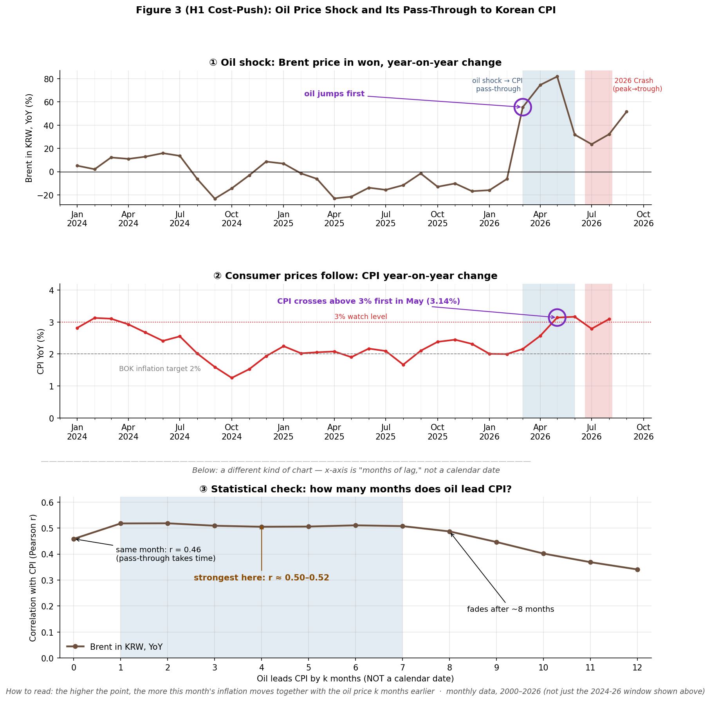

**คำถามของกราฟ:** เงินเฟ้อที่ขยับขึ้นก่อนวิกฤตมาจากราคาน้ำมันหรือไม่ และส่งผ่านด้วยความล่าช้ากี่เดือน

**สิ่งที่กราฟแสดง:** สามแผงเรียงจากบนลงล่าง สองแผงบนเป็นกราฟตามเวลา (ม.ค. 2024 – ก.ย. 2026) ส่วนแผงล่างเป็นกราฟคนละแบบ

*แผง ①: ราคาน้ำมันเบรนท์ในสกุลวอน เทียบเดือนเดียวกันของปีก่อน (YoY)*
- **เส้นสีน้ำตาล** คือ % การเปลี่ยนแปลงของราคาน้ำมันที่ผู้นำเข้าเกาหลีจ่ายจริง (ราคาดอลลาร์ × ค่าเงินวอน) เส้นที่ 0 = ราคาเท่ากับปีก่อน
- **วงกลมสีม่วง** ชี้เดือน มี.ค. 2026 ที่ราคาน้ำมันกระโดดขึ้น (oil jumps first)

*แผง ②: CPI YoY ช่วงเวลาเดียวกัน*
- **เส้นสีแดง** คืออัตราเงินเฟ้อ แกนตั้งเริ่มที่ 0 เพื่อไม่ให้การขยับเล็กน้อยดูรุนแรงเกินจริง
- **เส้นประสีเทาที่ 2%** คือเป้าหมายเงินเฟ้อของธนาคารกลางเกาหลี (BOK) **เส้นจุดสีแดงที่ 3%** คือเกณฑ์เฝ้าระวัง
- **วงกลมสีม่วง** ชี้เดือน พ.ค. 2026 ที่ CPI ข้าม 3% เป็นครั้งแรก (3.14%)

*แถบสีในแผง ① และ ②*
- **แถบสีฟ้าอมเทา** คือช่วงที่น้ำมันพุ่งและส่งผ่านไปยัง CPI (มี.ค.–มิ.ย. 2026)
- **แถบสีชมพู** คือช่วงวิกฤต 2026 จากจุดพีคถึงจุดต่ำสุดของ KOSPI (19 มิ.ย. → 7 ส.ค. 2026) เริ่มต่อจากแถบฟ้าแทบทันที
- เส้นกริดบางๆ แบ่งรายเดือน เพื่อให้อ่านตำแหน่งเดือนได้แม่นยำ

*แผง ③: การตรวจสอบเชิงสถิติ (อ่านคนละแบบกับสองแผงบน)*
- **แกนนอนไม่ใช่วันที่** แต่เป็นจำนวนเดือน (k = 0–12) ที่ราคาน้ำมันนำหน้า CPI
- **แกนตั้ง** คือค่าสหสัมพันธ์ (Pearson r) ระหว่างเงินเฟ้อเดือนนี้กับราคาน้ำมันในสกุลวอนเมื่อ k เดือนก่อน ยิ่งจุดสูงยิ่งเคลื่อนไหวไปด้วยกันมาก คำนวณจากข้อมูลรายเดือนทั้งช่วง 2000–2026 ไม่ใช่เฉพาะช่วงที่แสดงในสองแผงบน
- **แถบสีฟ้า** คือช่วง lag 1–7 เดือนที่ค่า r สูงที่สุด ป้ายที่ lag 0 บอกค่า r ของเดือนเดียวกัน

**ข้อสรุปสำคัญ:**
- **น้ำมันมาก่อน:** ราคาเบรนท์กระโดดจาก 71.12 เป็น 109.72 ดอลลาร์ (+54% ภายในเดือนเดียว ก.พ. → มี.ค. 2026)
- **เงินเฟ้อตามมา:** CPI ทะลุ 3% ครั้งแรกในเดือน พ.ค. (3.14%) และยังอยู่เหนือ 3% ในเดือน มิ.ย. ตรงกับช่วงจุดพีคของดัชนี
- **ระยะเวลาส่งผ่าน:** ราคาน้ำมันสัมพันธ์กับเงินเฟ้อสูงที่สุดเมื่อเว้นระยะ 1–7 เดือน (r ≈ 0.50–0.52 เกือบเท่ากันทั้งช่วง) แล้วค่อยๆ ลดลงเหลือ 0.34 ที่ 12 เดือน ส่วนเดือนเดียวกัน (lag 0) ได้เพียง 0.46 แปลว่าน้ำมันแพงไม่ได้ทำให้ราคาสินค้าขึ้นทันที ต้องใช้เวลาส่งผ่านไปยังค่าขนส่ง ค่าไฟ และต้นทุนสินค้า จึงสรุปได้ว่า**ส่งผ่านภายในราว 1–7 เดือน** ไม่ใช่เดือนใดเดือนหนึ่งที่แน่นอน ซึ่งสอดคล้องกับปี 2026 ที่น้ำมันพุ่งในเดือน มี.ค. และ CPI ขึ้นเกิน 3% ในเดือน พ.ค. ห่างกัน 2 เดือน
- **ทำไมใช้สกุลวอน:** เป็นต้นทุนที่ผู้นำเข้าเกาหลีจ่ายจริง เมื่อคำนวณด้วยสกุลดอลลาร์ ค่า r ต่ำกว่าที่ lag 0–11 (เช่น lag 0: 0.36 เทียบ 0.46) สอดคล้องกับที่ค่าเงินวอนอ่อนช่วยขยายต้นทุนนำเข้า
- **นโยบายการเงิน:** อัตราดอกเบี้ยไม่เปลี่ยนแปลงตลอดช่วง → เป็นเงินเฟ้อจากฝั่งต้นทุนที่นโยบายการเงินไม่ได้ตอบสนอง

> **ข้อควรระวัง:** r ≈ 0.52 อธิบายความแปรปรวนได้เพียงราว 1 ใน 4 (r² ≈ 0.27) จึงเป็นปัจจัยร่วม ไม่ใช่สาเหตุเดียว · เส้น 2% คือเป้าหมายเงินเฟ้อทางการของ BOK ส่วนเส้น 3% เป็นเกณฑ์เฝ้าระวังที่งานนี้กำหนดเอง · ไม่ได้วิเคราะห์อัตราดอกเบี้ยที่แท้จริง (Real Rate) เพราะซีรีส์ที่มีเป็น Discount Rate | **ที่มา:** Brent และ USDKRW (FRED) · CPI (OECD SDMX) · Discount Rate (FRED INTDSRKRM193N)

---

<a id="fig4"></a>
### Figure 4 · ความกลัวของตลาดโลกและสินทรัพย์ปลอดภัย

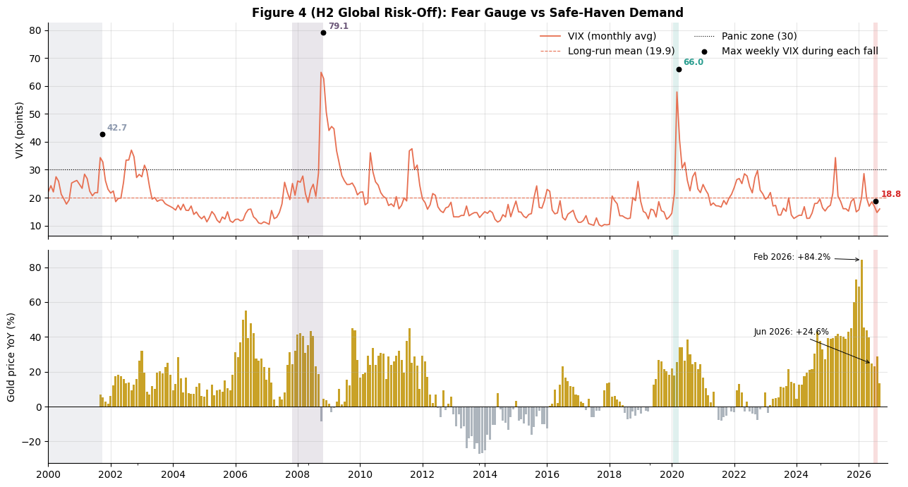

**คำถามของกราฟ:** การร่วงของ KOSPI ปี 2026 เกิดจากความตื่นตระหนกของตลาดการเงินโลกหรือไม่

**สิ่งที่กราฟแสดง:**

*แผงบน: VIX "ดัชนีวัดความกลัว" ของตลาดโลก* (วัดว่านักลงทุนคาดว่าตลาดหุ้นสหรัฐฯ จะผันผวนแค่ไหนใน 30 วันข้างหน้า ยิ่งสูงยิ่งกลัว)
- **เส้นสีส้ม** คือ VIX เฉลี่ยรายเดือน **เส้นประสีแดง** คือค่าเฉลี่ยระยะยาว (19.9) และ**เส้นจุดสีดำ**ที่ 30 คือเขตตื่นตระหนก
- **จุดสีดำ** คือค่า VIX สูงสุดรายสัปดาห์ในช่วงที่ KOSPI ร่วงจากจุดพีคถึงจุดต่ำสุดของแต่ละวิกฤต ตัวเลขข้างจุดคือค่า ณ จุดนั้น (ใช้สีเดียวกับวิกฤตนั้น)
- **ทำไมจุดสีดำอยู่สูงกว่าเส้น:** เส้นเป็นค่าเฉลี่ยทั้งเดือน ยอดแหลมที่เกิดเพียงไม่กี่วันจึงถูกเกลี่ยลง ส่วนจุดสีดำใช้ข้อมูลรายสัปดาห์จึงจับยอดได้ใกล้ความจริงกว่า เช่น GFC เส้นรายเดือนขึ้นไปสูงสุด 64.9 แต่สัปดาห์ที่กลัวที่สุดอยู่ที่ 79.1 (Dot-com 34.4 → 42.7, COVID-19 57.8 → 66.0)
- **ตำแหน่งของจุด:** ใน 3 วิกฤตแรก จุดสีดำตรงกับสัปดาห์ที่ KOSPI ทำจุดต่ำสุดพอดี (21 ก.ย. 2001, 24 ต.ค. 2008, 20 มี.ค. 2020) แปลว่าความกลัวสูงสุดเกิดพร้อมการเทขายหนักที่สุด ส่วนปี 2026 จุดสีดำ (17 ก.ค. 2026) แทบแนบไปกับเส้นที่ 18.8 ไม่มียอดแหลมเลย
- ยอด VIX ที่เกิน 30 **นอกแถบสี** (เช่น ปี 2002, 2011 และ เม.ย. 2025) คือช่วงที่ตลาดโลกกลัว แต่ KOSPI ไม่ได้อยู่ในวิกฤตที่ศึกษา

*แผงล่าง: ราคาทองคำเทียบเดือนเดียวกันของปีก่อน (YoY)* ทองคำเป็นสินทรัพย์ปลอดภัย เมื่อนักลงทุนหนีความเสี่ยง ราคาทองคำมักเร่งตัวขึ้น
- **แท่งสีทอง** คือเดือนที่ราคาสูงกว่าปีก่อน **แท่งสีเทา** คือต่ำกว่าปีก่อน
- ข้อมูลทองคำเริ่ม ก.ย. 2001 แผงล่างช่วงต้นจึงว่าง

**ข้อสรุปสำคัญ:**
- **VIX (หลักฐานหลัก):** ใน 3 วิกฤตก่อนหน้า VIX ทะลุเขตตื่นตระหนก 30 ทุกครั้ง (Dot-com 42.7, GFC 79.1, COVID-19 66.0) แต่ปี 2026 สูงสุดเพียง 18.8 ต่ำกว่าค่าเฉลี่ยระยะยาว (19.9) ด้วยซ้ำ ตลาดโลกไม่ได้ตื่นตระหนกตลอดช่วงที่ KOSPI ร่วง 30.9%
- **ทองคำ (หลักฐานประกอบ):** ทองคำ YoY ขึ้นสูงสุด +84.2% ใน ก.พ. 2026 ซึ่งเป็น 4 เดือน**ก่อน**จุดพีคของ KOSPI แล้วชะลอลงเหลือ +24.6% (มิ.ย.) และ +23.1% (ก.ค.) ระหว่างที่ KOSPI ร่วง ไม่มีแรงซื้อสินทรัพย์ปลอดภัยรอบใหม่
- ทองคำไม่ได้พุ่งขึ้นทุกวิกฤต ช่วง COVID-19 ทองคำ YoY เร่งขึ้นจาก 22.0% เป็น 25.6% แต่ช่วง GFC กลับติดลบ −8.6% ณ เดือนที่ KOSPI ต่ำสุด เพราะนักลงทุนขายทุกสินทรัพย์รวมถึงทองคำเพื่อเสริมสภาพคล่อง ทองคำจึงใช้เป็นหลักฐานประกอบ ส่วนหลักฐานหลักคือ VIX
- **สรุป:** การร่วงของ KOSPI ปี 2026 ไม่ได้มาจากภาวะหลบความเสี่ยงระดับโลก (Global Risk-Off)

> **ข้อควรระวัง:** ทองคำยังเติบโตเกิน 20% YoY ตลอดช่วงวิกฤต (ต่ำกว่า 20% ครั้งแรกใน ก.ย. 2026 ซึ่งหลังจุดต่ำสุดแล้ว) การเปลี่ยนแปลงจึงเป็นการชะลอตัวของการเติบโต ไม่ใช่ราคาทองคำลดลง · VIX สูงสุดใช้ข้อมูลรายสัปดาห์ อาจต่ำกว่าจุดสูงสุดระหว่างวัน | **ที่มา:** VIX และ Gold Futures (GC=F) จาก yfinance

---

<a id="fig5"></a>
### Figure 5 · ค่าเงินวอนเป็นสัญญาณเตือนได้หรือไม่

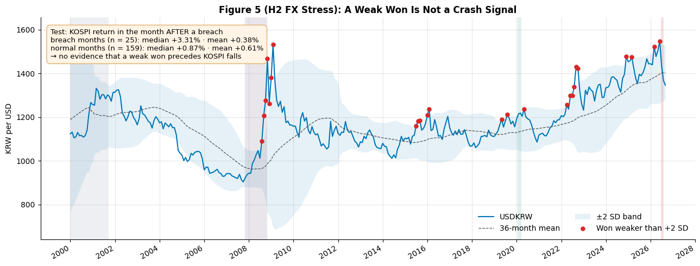

**คำถามของกราฟ:** ค่าเงินวอนที่อ่อนผิดปกติ ใช้เป็นสัญญาณเตือนล่วงหน้าได้หรือไม่

**สิ่งที่กราฟแสดง:** ค่าเงินวอนรายเดือน 2000–2026 พร้อมกรอบที่บอกว่าเดือนไหนอ่อนค่า "ผิดปกติ"
- **เส้นสีน้ำเงิน** คือ USDKRW (จำนวนวอนต่อ 1 ดอลลาร์) **เส้นขึ้น = วอนอ่อนค่า**
- **เส้นประสีเทา** คือค่าเฉลี่ยเคลื่อนที่ 36 เดือน ใช้เป็นระดับ "ปกติ" ของช่วง 3 ปีที่ผ่านมา
- **แถบสีฟ้า** คือกรอบ ±2 ส่วนเบี่ยงเบนมาตรฐาน (SD) รอบค่าเฉลี่ย กรอบกว้างในช่วงที่ค่าเงินผันผวนมาก เช่น ปี 2000–2001 ที่หน้าต่าง 36 เดือนยังรวมช่วงวิกฤตการเงินเอเชีย 1997–98 และช่วงหลัง GFC
- **จุดสีแดง** คือเดือนที่ค่าเงินอ่อนทะลุกรอบบน (Z-score > 2) มีทั้งหมด 25 เดือนตั้งแต่ปี 2000
- **กล่องข้อความมุมซ้ายบน** คือผลการทดสอบ: เทียบผลตอบแทน KOSPI ใน**เดือนถัดไป**หลังจุดสีแดง กับเดือนปกติ

**ข้อสรุปสำคัญ:**
- **ผลทดสอบ:** หลังเดือนที่วอนอ่อนทะลุกรอบ (n = 25) KOSPI เดือนถัดไปมีมัธยฐาน +3.31% และค่าเฉลี่ย +0.38% เทียบกับเดือนปกติ (n = 159) ที่มัธยฐาน +0.87% และค่าเฉลี่ย +0.61% ไม่ได้แย่กว่าเดือนปกติ → **ไม่พบหลักฐาน**ว่าค่าเงินอ่อนนำไปสู่การร่วง
- จุดสีแดงช่วงปี 2008 เกิดในช่วงท้ายของการร่วง GFC และหลังจากนั้น ค่าเงินอ่อนตามวิกฤต ไม่ได้มาก่อนวิกฤต
- **ปี 2026:** เดือน มิ.ย. ค่าเงินอยู่ที่ 1,549 วอน/ดอลลาร์ (Z = 2.21) ทะลุกรอบพอดีกับจุดพีค แต่ผลทดสอบย้อนหลังชี้ว่าสัญญาณนี้ไม่ได้บอกล่วงหน้าว่าตลาดจะร่วง จึงไม่ใช่ตัวจุดชนวน

> **ข้อควรระวัง:** ใช้ผลตอบแทนเดือนถัดไปเพื่อหลีกเลี่ยง look-ahead bias กลุ่มตัวอย่างมีเพียง 25 เดือน ไม่ได้ทดสอบนัยสำคัญทางสถิติ | **ที่มา:** USDKRW (FRED) · KOSPI (yfinance)

---

<a id="fig6"></a>
### Figure 6 · เปรียบเทียบความเร็วและความลึกของการร่วง

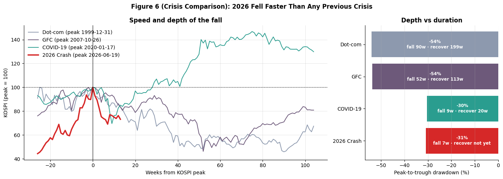

**คำถามของกราฟ:** รูปแบบการร่วงของปี 2026 แตกต่างจากวิกฤตในอดีตอย่างไร

**สิ่งที่กราฟแสดง:** เทียบการร่วงของ 4 วิกฤตบนฐานเดียวกัน

*แผงซ้าย: เส้นทางราคาของแต่ละวิกฤต*
- ปรับทุกวิกฤตให้ค่าดัชนี ณ จุดพีค = 100 (**เส้นประแนวนอน**) และวางจุดพีคไว้ที่สัปดาห์ 0 (**เส้นแนวตั้งสีดำ**) ทั้ง 4 วิกฤตจึงเริ่มจากจุดเดียวกัน
- **แกนนอน** คือจำนวนสัปดาห์ก่อนพีค (ค่าติดลบ) และหลังพีค (−26 ถึง +104 สัปดาห์)
- **แกนตั้ง** อ่านเป็น % ของพีค เช่น 70 หมายถึงต่ำกว่าพีค 30%
- **เส้นสีแดงหนา** คือปี 2026 ซึ่งจบที่ข้อมูลล่าสุด (18 ก.ย. 2026)
- ฝั่งซ้ายของเส้น 0 เส้นสีแดงเริ่มที่ราว 44 แปลว่า 26 สัปดาห์ก่อนพีค ดัชนีอยู่ที่เพียง 44% ของพีค หรือ KOSPI พุ่งขึ้น +125% ภายใน 6 เดือนก่อนพีค ขณะที่วิกฤตอื่นทรงตัวกว่ามากก่อนพีค

*แผงขวา: ความลึกเทียบระยะเวลา*
- **ความยาวแท่ง** คือ % ที่ดัชนีร่วงจากพีคถึงจุดต่ำสุด
- **ข้อความในแท่ง:** fall = จำนวนสัปดาห์ที่ใช้ร่วงจนถึงจุดต่ำสุด และ recover = จำนวนสัปดาห์ที่ใช้ฟื้นกลับไปถึงระดับพีคเดิม

**ข้อสรุปสำคัญ:**
- **ความลึก:** ปี 2026 (−30.9%) ใกล้เคียง COVID-19 (−30.4%) และตื้นกว่า Dot-com และ GFC (ราว −54%)
- **ความเร็ว:** ใช้เวลาเพียง 7 สัปดาห์ เทียบกับ COVID-19 9 สัปดาห์ และเร็วกว่า Dot-com (90 สัปดาห์) และ GFC (52 สัปดาห์) ราว 7–13 เท่า อัตราการร่วงเฉลี่ย 4.4% ต่อสัปดาห์ สูงที่สุดใน 4 วิกฤต
- **การฟื้นตัว:** COVID-19 ฟื้นกลับพีคใน 20 สัปดาห์ ส่วนปี 2026 ยังไม่ฟื้น
- **สรุป:** ดัชนีพุ่งแรงก่อนพีคแล้วร่วงเร็วผิดปกติ สอดคล้องกับการเร่งปิดสถานะ มากกว่าการปรับมุมมองต่อปัจจัยพื้นฐานซึ่งมักใช้เวลานานกว่า

> **ข้อควรระวัง:** สถานะ ณ วันที่ 18 ก.ย. 2026 ดัชนีอยู่ราว 6,627 จุด (ต่ำกว่าพีค ~26.8%) ตัวเลขนี้อาจเปลี่ยนเมื่อมีข้อมูลเพิ่ม | **ที่มา:** KOSPI จาก yfinance

---

<a id="fig7"></a>
### Figure 7 · ปัจจัยที่เคลื่อนไหวไปพร้อมกับ KOSPI มากที่สุด

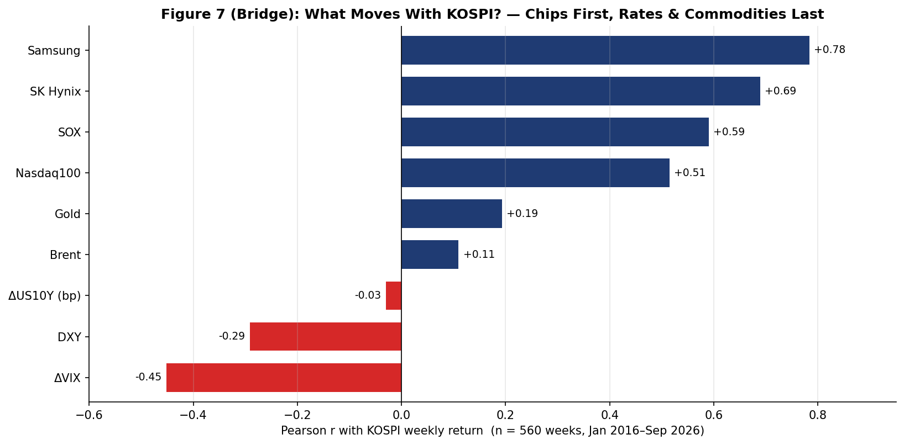

**คำถามของกราฟ:** ในรอบ 10 ปี อะไรคือปัจจัยที่สัมพันธ์กับการเคลื่อนไหวของ KOSPI มากที่สุด

**สิ่งที่กราฟแสดง:** ค่าสหสัมพันธ์ระหว่าง KOSPI กับตัวแปร 9 ตัว
- **1 แท่ง = 1 ตัวแปร** ความยาวแท่งคือค่า Pearson r ระหว่างผลตอบแทนรายสัปดาห์ของ KOSPI กับการเปลี่ยนแปลงรายสัปดาห์ของตัวแปรนั้น ใช้ข้อมูล 560 สัปดาห์ (ม.ค. 2016 – ก.ย. 2026)
- **แท่งสีน้ำเงิน** (r บวก) = เคลื่อนไหวทางเดียวกับ KOSPI **แท่งสีแดง** (r ลบ) = เคลื่อนไหวสวนทาง เรียงจากบวกมากที่สุดลงไปลบมากที่สุด
- ค่า r อยู่ระหว่าง −1 ถึง +1 ยิ่งใกล้ 0 ยิ่งแทบไม่สัมพันธ์กัน
- **ΔUS10Y (bp)** คือการเปลี่ยนแปลงผลตอบแทนพันธบัตรรัฐบาลสหรัฐฯ อายุ 10 ปี หน่วย basis point **ΔVIX** คือการเปลี่ยนแปลงของ VIX และ **DXY** คือดัชนีค่าเงินดอลลาร์

**ข้อสรุปสำคัญ:**
- **หุ้นชิปมาก่อน:** สองอันดับแรกคือหุ้นชิปในประเทศ Samsung (r = 0.78) และ SK Hynix (r = 0.69) ตามด้วยหุ้นเทคสหรัฐฯ SOX (0.59) และ Nasdaq100 (0.51)
- **โภคภัณฑ์และดอกเบี้ยท้ายสุด:** ทองคำ (+0.19), Brent (+0.11) และ ΔUS10Y (−0.03) แทบไม่สัมพันธ์กับ KOSPI
- **ตัวแปรที่สวนทาง:** DXY (−0.29) สัปดาห์ที่ดอลลาร์แข็ง KOSPI มักลง และ ΔVIX (−0.45) สัปดาห์ที่ความกลัวเพิ่ม KOSPI มักลง ยิ่งตอกย้ำว่าการที่ VIX ไม่ขยับเลยในปี 2026 (Figure 4) ไม่ใช่รูปแบบปกติ

> **ข้อควรระวัง:** Samsung และ SK Hynix เป็นองค์ประกอบของ KOSPI เอง ค่า r ที่สูงจึงสะท้อนน้ำหนักในดัชนีบางส่วน ไม่ใช่ความสัมพันธ์ระหว่างสินทรัพย์อิสระ | **ที่มา:** yfinance (หุ้น, ดัชนี, VIX, ทองคำ) · FRED (Brent, US10Y)

---

<a id="fig8"></a>
### Figure 8 · ใครคือผู้ลากดัชนีตลอด 10 ปี

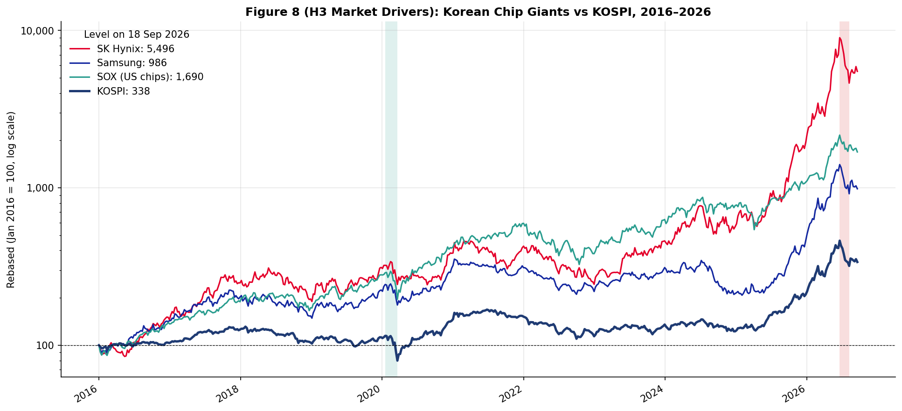

**คำถามของกราฟ:** การเติบโตของ KOSPI ในรอบ 10 ปีมาจากหุ้นกลุ่มใด และเคลื่อนไหวตามวัฏจักรใด

**สิ่งที่กราฟแสดง:** เทียบการเติบโตของหุ้นชิปกับ KOSPI ตลอด 10 ปี
- ปรับทุกเส้นให้สัปดาห์แรกของปี 2016 = 100 (**เส้นประ**) เพื่อเทียบการเติบโตจากจุดเริ่มเดียวกัน
- แกนตั้งเป็น**มาตราส่วนลอการิทึม** แต่ละช่วงหลัก (100 → 1,000 → 10,000) คือการเติบโต 10 เท่า
- **เส้นสีแดง** = SK Hynix **เส้นสีน้ำเงิน** = Samsung **เส้นสีเขียว** = SOX (ดัชนีหุ้นชิปสหรัฐฯ) **เส้นสีน้ำเงินเข้มหนา** = KOSPI
- **ตัวเลขในคำอธิบายเส้น** คือระดับ ณ 18 ก.ย. 2026 เช่น SK Hynix 5,496 หมายถึงโต 55 เท่าจากปี 2016
- **ตัวเลข % ทางขวา** คือการร่วงของแต่ละเส้นระหว่างวิกฤต 2026 (19 มิ.ย. → 7 ส.ค.) **แถบสีชมพู** = ช่วงวิกฤต 2026 **แถบสีเขียวอมฟ้า** = ช่วง COVID-19

**ข้อสรุปสำคัญ:**
- **ขาขึ้น:** ตลอด 10 ปี KOSPI โต 3.4 เท่า ขณะที่ Samsung โต 9.9 เท่า และ SK Hynix โตถึง 55.0 เท่า หุ้นชิปทั้งสองเคลื่อนไหวเกาะวัฏจักรของ SOX ซึ่งโต 16.9 เท่าในช่วงเดียวกัน
- **ขาลง:** ระหว่างวิกฤต 2026 ตัวที่โตแรงที่สุดก็ร่วงแรงที่สุด SK Hynix −48.6%, Samsung −34.7%, KOSPI −30.9% ขณะที่ SOX ต้นทางในสหรัฐฯ ร่วงเพียง −13.8%
- ช่องว่างการเติบโตนี้ทำให้น้ำหนักของหุ้นชิปในดัชนีเพิ่มขึ้นเรื่อยๆ ซึ่งวัดเป็นตัวเลขใน Figure 9

> **ข้อควรระวัง:** ราคาปรับการแตกพาร์แล้วแต่ไม่ได้ปรับเงินปันผล ตัวเลขจึงเป็น price return ไม่ใช่ total return | **ที่มา:** yfinance

---

<a id="fig9"></a>
### Figure 9 · การกระจุกตัวของตลาด (CR5) เทียบกับการร่วงของดัชนี

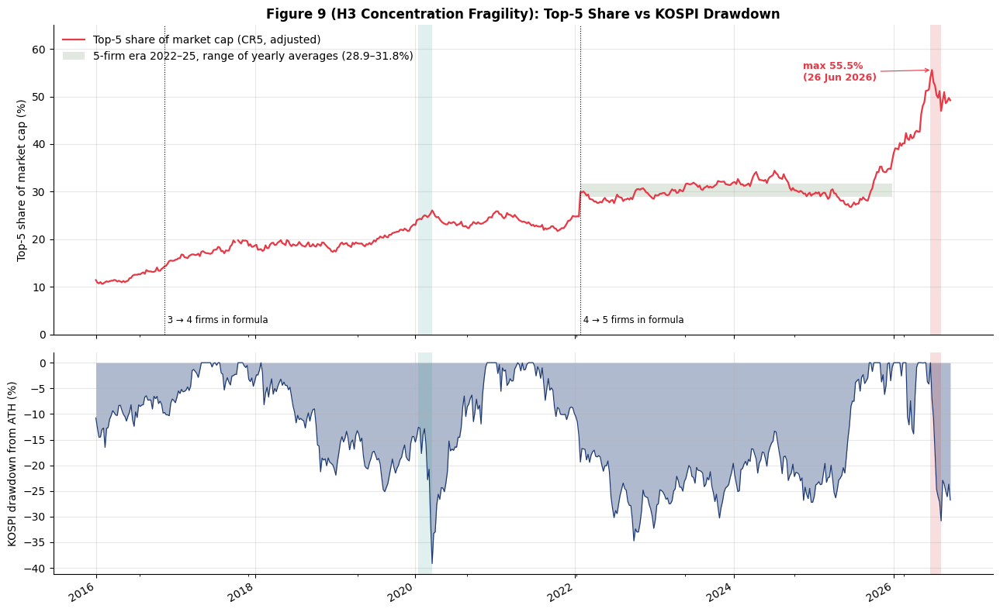

**คำถามของกราฟ:** สัดส่วนของหุ้นขนาดใหญ่สุด 5 ตัวเพิ่มขึ้นจนทำให้ตลาดเปราะบางหรือไม่

**สิ่งที่กราฟแสดง:** สองแผงบนแกนเวลาเดียวกัน (รายสัปดาห์ 2016–2026)

*แผงบน: CR5 สัดส่วนมูลค่าตลาดของ 5 บริษัทใหญ่ที่สุด*
- **เส้นสีแดง** คือ % มูลค่าตลาดของ Top-5 เทียบกับทั้ง KOSPI ปรับตัวหารให้เคลื่อนไหวตามดัชนี (CR5 adjusted)
- **เส้นจุดแนวตั้ง 2 เส้น** คือจุดที่จำนวนบริษัทในสูตรเพิ่มขึ้น (3 → 4 บริษัท พ.ย. 2016 และ 4 → 5 บริษัท ม.ค. 2022) เส้นสีแดงที่กระโดดขึ้นตรงจุดเหล่านี้เป็นผลจากการเพิ่มบริษัทในสูตร ไม่ใช่การกระจุกตัวจริง
- **แถบสีเขียวอ่อน** คือช่วงค่าเฉลี่ยรายปีของยุค 5 บริษัท 2022–2025 (28.9–31.8%) ใช้เป็นเกณฑ์ระดับ "ปกติ" ของยุคนี้
- **ป้ายสีแดง** ชี้ค่าสูงสุด 55.5% ในสัปดาห์ 26 มิ.ย. 2026

*แผงล่าง: KOSPI ต่ำกว่าจุดสูงสุดตลอดกาล (Drawdown from ATH)*
- **พื้นที่สีน้ำเงิน** คือดัชนีอยู่ต่ำกว่าจุดสูงสุดตลอดกาลกี่ % ค่า 0 = ทำจุดสูงสุดใหม่ ยิ่งลึกยิ่งห่างจากจุดสูงสุด
- **ป้าย** ชี้จุดที่ลึกที่สุดของ COVID-19 (−39.2%) และปี 2026 (−30.9%) และค่าล่าสุด (−26.8%)
- ค่า COVID-19 −39.2% ไม่ตรงกับ −30.4% ใน Figure 6 เพราะแผงนี้วัดจากจุดสูงสุดตลอดกาล (ม.ค. 2018) ส่วน Figure 6 วัดจากพีคก่อนวิกฤต (17 ม.ค. 2020)

**ข้อสรุปสำคัญ:**
- จำนวนบริษัทในสูตรไม่คงที่ (3 → 4 → 5) การเทียบข้ามยุคจึงต้องระวัง จึงเปรียบเทียบเฉพาะภายในยุค 5 บริษัท
- **ปี 2022–2025:** ค่าเฉลี่ยรายปีทรงตัวที่ 28.9–31.8% ติดต่อกัน 4 ปี
- **ปี 2026:** กระโดดเป็นเฉลี่ย 45.8% และสูงสุด 55.5% (54.0% ณ วันพีค) โดยจำนวนบริษัทไม่เปลี่ยน → เป็นการกระจุกตัวจริง ไม่ใช่ผลจากวิธีคำนวณ และสูงกว่า COVID-19 (24.1%) ถึง 2.2 เท่า
- ตลาดกระจุกตัวสูงสุดในช่วงเดียวกับที่ดัชนีเริ่มร่วงหนัก

> **ข้อควรระวัง:** ค่าที่ได้เป็นค่าประมาณ เพราะสมมติว่ามูลค่าตลาดรวมเคลื่อนไหวตามดัชนี และใช้จำนวนหุ้นจดทะเบียน ณ วันดึงข้อมูลย้อนหลังทั้งช่วง | **ที่มา:** KRX market-cap snapshot + yfinance

---

<a id="fig10"></a>
### Figure 10 · ความเสียหายกระจุกอยู่ที่ใคร และความผันผวนฉีกตัวหรือไม่

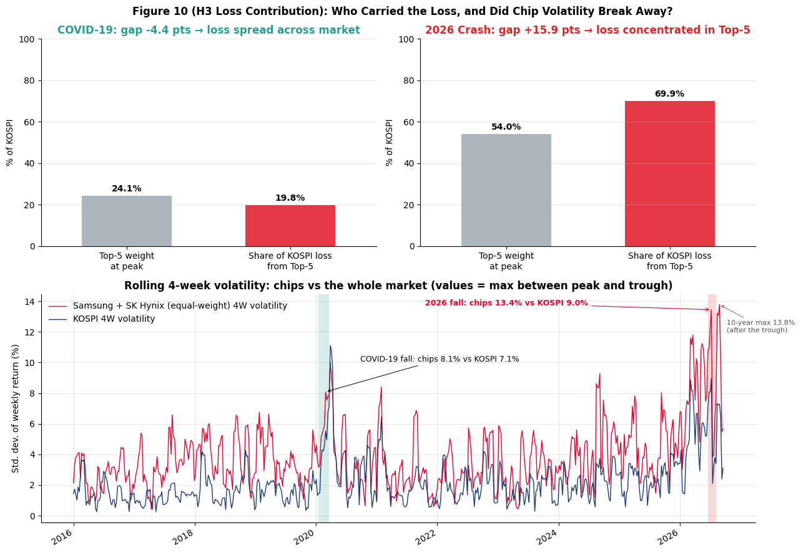

**คำถามของกราฟ:** มูลค่าตลาดที่หายไประหว่างวิกฤตมาจากหุ้นกลุ่มใด และความผันผวนของหุ้นชิปต่างจากตลาดรวมแค่ไหน

**สิ่งที่กราฟแสดง:** สองคำถามในภาพเดียว แผงบนดูว่าใครแบกความเสียหาย แผงล่างดูความผันผวน

*แผงบน (ซ้าย COVID-19, ขวา 2026): ความเสียหายเทียบน้ำหนัก*
- **แท่งสีเทา** คือน้ำหนักของ Top-5 ในดัชนี ณ จุดพีค หรือสัดส่วนความเสียหายที่ "ควรเป็น" ถ้าทุกหุ้นร่วงเท่ากัน
- **แท่งสีแดง** คือสัดส่วนของมูลค่าตลาดที่หายไปทั้งหมดซึ่งมาจาก Top-5
- **หัวกราฟ gap** = แท่งแดง − แท่งเทา ค่าบวกแปลว่า Top-5 เสียหายเกินน้ำหนักของตัวเอง (ความเสียหายกระจุก) ค่าลบแปลว่าเสียหายน้อยกว่าน้ำหนัก (ความเสียหายกระจายทั่วตลาด)

*แผงล่าง: ความผันผวน 4 สัปดาห์*
- **เส้นสีแดง** คือความผันผวนของตะกร้าหุ้นชิป (Samsung + SK Hynix ถ่วงน้ำหนักเท่ากัน) **เส้นสีน้ำเงิน** คือความผันผวนของ KOSPI คำนวณจากส่วนเบี่ยงเบนมาตรฐานของผลตอบแทนรายสัปดาห์ย้อนหลัง 4 สัปดาห์ ยิ่งสูงยิ่งเหวี่ยงแรง
- **ป้ายในกราฟ** บอกค่าสูงสุดระหว่างพีคถึงจุดต่ำสุดของแต่ละวิกฤต ส่วนป้ายสีเทา "10-year max 13.8%" เกิดหลังจุดต่ำสุดแล้ว จึงไม่นำมาเทียบ

**ข้อสรุปสำคัญ:**
- **COVID-19:** Top-5 มีน้ำหนัก 24.1% แต่สร้างความเสียหาย 19.8% (gap −4.4 จุด) ความเสียหายกระจายทั่วตลาด
- **2026:** Top-5 มีน้ำหนัก 54.0% แต่สร้างความเสียหาย 69.9% (gap +15.9 จุด) แรงขายกระจุกที่กลุ่มผู้นำตลาดอย่างผิดสัดส่วน
- **ความผันผวน:** ปี 2026 หุ้นชิปผันผวนถึง 13.4% เทียบตลาดรวม 9.0% ขณะที่ช่วง COVID-19 ใกล้เคียงกัน (8.1% เทียบ 7.1%) → ความผันผวนของหุ้นชิปฉีกตัวออกจากตลาดรวมอย่างชัดเจน

> **ข้อควรระวัง:** สัดส่วนความเสียหายอาศัยสมมติฐานว่ามูลค่าตลาดรวมเคลื่อนไหวตามดัชนี ความผันผวนของหุ้นชิปถ่วงน้ำหนักเท่ากันระหว่าง Samsung และ SK Hynix ไม่ได้ถ่วงตามมูลค่าตลาด | **ที่มา:** KRX market-cap snapshot + yfinance

---

<a id="fig11"></a>
### Figure 11 · วิกฤตโลกหรือวิกฤตเฉพาะเกาหลี

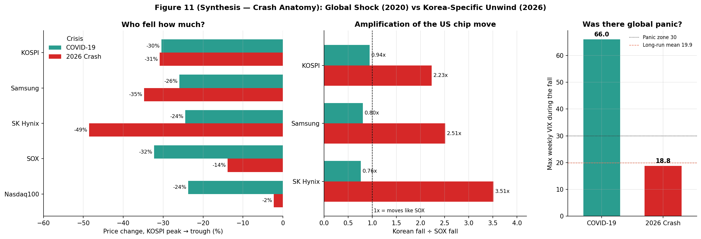

**คำถามของกราฟ:** ปี 2026 เป็นวิกฤตที่เกิดพร้อมกันทั่วโลก หรือเป็นวิกฤตเฉพาะของเกาหลีใต้

**สิ่งที่กราฟแสดง:** สามแผงเทียบ COVID-19 (สีเขียว) กับ 2026 (สีแดง) ทุกแผงใช้ช่วงจากวันพีคถึงวันต่ำสุดของ KOSPI ในแต่ละวิกฤต

*แผงซ้าย: ใครร่วงเท่าไร (Who fell how much?)*
- แท่งคือ % การเปลี่ยนแปลงของ 5 สินทรัพย์ในช่วงเดียวกัน 3 แถวบน (KOSPI, Samsung, SK Hynix) คือตลาดเกาหลี 2 แถวล่าง (SOX, Nasdaq100) คือตลาดสหรัฐฯ

*แผงกลาง: อัตราขยายแรงเหวี่ยง (Amplification)*
- คำนวณจาก การร่วงของหุ้นเกาหลี ÷ การร่วงของ SOX ในช่วงเดียวกัน
- **เส้นประที่ 1x** = ร่วงเท่ากับ SOX ค่าเกิน 1 แปลว่าร่วงแรงกว่าต้นทางในสหรัฐฯ

*แผงขวา: มีความตื่นตระหนกระดับโลกหรือไม่*
- แท่งคือ VIX สูงสุดรายสัปดาห์ระหว่างการร่วง (ค่าเดียวกับจุดสีดำใน Figure 4) **เส้นจุด**ที่ 30 คือเขตตื่นตระหนก **เส้นประ**ที่ 19.9 คือค่าเฉลี่ยระยะยาว

**ข้อสรุปสำคัญ:**
- **COVID-19 = วิกฤตโลก:** ทุกตลาดร่วงใกล้เคียงกัน (−23.8% ถึง −32.2%) อัตราขยาย 0.76–0.94 เท่า (หุ้นเกาหลีร่วงน้อยกว่า SOX เล็กน้อย) และ VIX พุ่งถึง 66.0
- **2026 = วิกฤตเฉพาะเกาหลี:** สหรัฐฯ แทบไม่กระทบ (Nasdaq100 −2.2%, SOX −13.8%) แต่ Samsung −34.7% และ SK Hynix −48.6% อัตราขยาย KOSPI 2.23 เท่า, Samsung 2.51 เท่า, SK Hynix 3.51 เท่า โดยที่ VIX สูงสุดเพียง 18.8
- **สรุป:** เป็นการปรับฐานที่เริ่มจากหุ้นชิปสหรัฐฯ แล้วถูกขยายผลอย่างรุนแรงภายในตลาดเกาหลีเอง ไม่ใช่วิกฤตระดับโลก

> **ข้อควรระวัง:** อัตราขยายหารด้วยการร่วงของ SOX ซึ่งมีค่าเพียงราว -14% ตัวหารเล็กทำให้อัตราส่วนพองตัวได้ง่าย จึงแสดงตัวเลขการร่วงจริงควบคู่กันในแผงแรก | **ที่มา:** yfinance

---

<a id="fig12"></a>
### Figure 12 · หลักฐานเชิงพฤติกรรมของภาวะ Forced Unwind

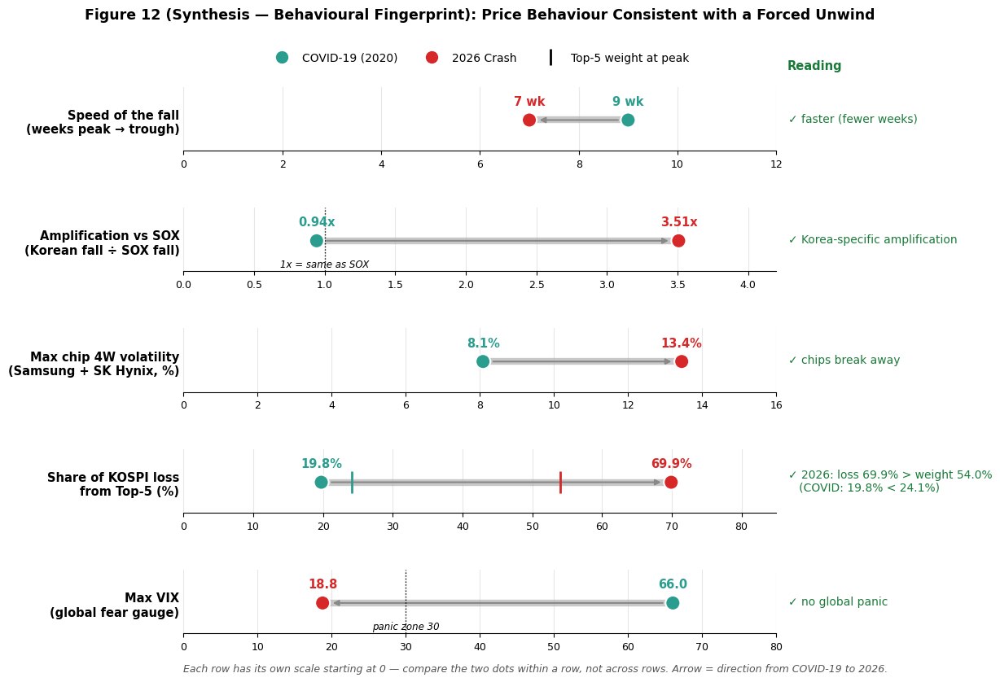

**คำถามของกราฟ:** มีหลักฐานอะไรบ้างที่บ่งชี้ว่าการร่วงครั้งนี้เกิดจากการปิดสถานะแบบถูกบังคับ ทั้งที่ไม่มีข้อมูลหนี้มาร์จิ้นเป็น time series

**สิ่งที่กราฟแสดง:** Dumbbell chart รวมหลักฐาน 5 ข้อจากกราฟก่อนหน้า เทียบ COVID-19 กับ 2026
- **1 แถว = 1 หลักฐาน:** ความเร็วในการร่วง (Figure 6), อัตราขยายเทียบ SOX (Figure 11), ความผันผวนหุ้นชิป (Figure 10), สัดส่วนความเสียหายจาก Top-5 (Figure 10) และ VIX สูงสุด (Figure 4)
- **จุดสีเขียว** = COVID-19 **จุดสีแดง** = 2026 **ลูกศรสีเทา** = ทิศทางจาก COVID-19 ไป 2026
- **แต่ละแถวมีสเกลของตัวเองเริ่มที่ 0** จึงเทียบได้เฉพาะสองจุดในแถวเดียวกัน ไม่เทียบข้ามแถว
- **เส้นอ้างอิงในแถว:** แถวอัตราขยายมีเส้นจุดที่ 1x (= ร่วงเท่า SOX) แถว VIX มีเส้นจุดที่ 30 (เขตตื่นตระหนก) แถวสัดส่วนความเสียหายมี**ขีดแนวตั้ง**แสดงน้ำหนัก Top-5 ณ พีคของแต่ละวิกฤต (เขียว 24.1%, แดง 54.0%) ถ้าจุดอยู่ทางขวาของขีดสีเดียวกัน แปลว่าเสียหายเกินน้ำหนัก
- **คอลัมน์ Reading** ทางขวา คือการอ่านผลของแต่ละแถว เครื่องหมาย ✓ หมายถึงผลเป็นไปตามรูปแบบของภาวะ Forced Unwind

**ข้อสรุปสำคัญ:**
- หลักฐานทั้ง 5 แถวชี้ไปทางเดียวกัน
  - ร่วงเร็วกว่า (7 เทียบ 9 สัปดาห์)
  - หุ้นกลุ่มเดียวเหวี่ยงแรงกว่าต้นทาง (3.51x เทียบ 0.94x)
  - ความผันผวนหุ้นชิปพุ่งขึ้น (13.4% เทียบ 8.1%)
  - ความเสียหายกระจุกเกินน้ำหนัก (69.9% เทียบน้ำหนัก 54.0%)
  - ทั้งหมดเกิดขึ้นโดยที่ตลาดโลกไม่ตื่นตระหนก (VIX 18.8 เทียบ 66.0)
- **สรุป:** รูปแบบนี้สอดคล้องกับการปิดสถานะแบบถูกบังคับ (Forced Unwind) มากกว่าการปรับมุมมองต่อปัจจัยพื้นฐาน

> **ข้อควรระวัง:** ผลนี้บอกได้ว่าลักษณะพฤติกรรมราคา**สอดคล้องกับ**ภาวะ Forced Unwind (*consistent with a liquidation cascade*) แต่ไม่สามารถสรุปได้ว่าเกิดจาก Leverage หรือ Margin Call โดยตรง เพราะไม่มีชุดข้อมูลหนี้มาร์จิ้นที่ประมวลผลเองได้ | **ที่มา:** คำนวณโดยผู้จัดทำจากตัวแปรในกราฟ 4, 6, 10 และ 11

**หลักฐานภายนอกที่สอดคล้องกับกลไก** (จากรายงานข่าวการเงิน ไม่ใช่ข้อมูลที่ประมวลผลในรายงานนี้): เกาหลีใต้เปิดตัว Single-Stock Leveraged/Inverse ETF บน Samsung และ SK Hynix เป็นครั้งแรก 16 กองทุน เมื่อ 27 พ.ค. 2026 (*The Korea Herald, ETF.com*) กองทุนกลุ่มนี้ต้อง rebalance ทุกวันปิดตลาด เมื่อราคาลงจึงต้องขายหุ้นเพิ่ม (*Bloomberg*) วันที่ร่วงหนักที่สุด (23 มิ.ย. 2026) Samsung -12.31% และ SK Hynix -12.47% (หนักที่สุดตั้งแต่ปี 2008) โดย Bloomberg Intelligence ประเมินแรงขายเชิงกลไกราว 6 พันล้านดอลลาร์ในวันเดียว คิดเป็นราว 14% ของปริมาณซื้อขาย

> **ข้อควรระวัง:** ตัวเลขในส่วนนี้มาจากรายงานข่าว ไม่ใช่ raw data ที่ตรวจสอบเองได้ จึงใช้เป็น**หลักฐานสนับสนุนเชิงบริบท**เท่านั้น และไม่นำตัวเลขจำนวนบัญชีที่ถูก Margin Call มาใช้ เพราะแต่ละแหล่งรายงานต่างกันเกือบ 10 เท่า

---

## 📑 แหล่งข้อมูลและข้อจำกัด (Data Sources & Limitations)

| ตัวแปร | แหล่งข้อมูล | สถานะ | ข้อจำกัดที่ตรวจพบ |
|---|---|---|---|
| KOSPI | yfinance | ใช้ได้เต็มที่ | รายสัปดาห์ ถึง 18 ก.ย. 2026 |
| Samsung, SK Hynix | yfinance | ใช้ได้เต็มที่ | ปรับการแตกพาร์แล้วแต่ไม่ปรับเงินปันผล |
| SOX, Nasdaq100, DXY | yfinance | ใช้ได้เต็มที่ | — |
| VIX | yfinance | ใช้ได้ มีเงื่อนไข | ฐานรายสัปดาห์ อาจต่ำกว่าจุดสูงสุดรายวัน |
| ทองคำ (Gold Futures) | yfinance | ใช้ได้ มีเงื่อนไข | เริ่มข้อมูลราวปี 2000 |
| CPI เกาหลี | OECD SDMX | ใช้ได้เต็มที่ | ถึง ส.ค. 2026 |
| Brent, USDKRW | FRED | ใช้ได้เต็มที่ | — |
| อัตราการว่างงาน | FRED | ใช้ได้เต็มที่ | ถึง ก.ค. 2026 |
| OECD CLI | OECD SDMX | ใช้ได้ มีเงื่อนไข | หยุดที่ พ.ค. 2026 (ก่อนจุดพีค 1 เดือน) |
| Real GDP | FRED (รายไตรมาส) | ใช้ได้เต็มที่ | แสดงเป็นรายไตรมาสตามจริง (ไม่ interpolate) · ล่าสุด Q2 2026 · ไตรมาสถัดไปจะมีเมื่อ BOK ประกาศ |
| CR5 (สัดส่วน Top-5) | KRX snapshot + yfinance | ต้องปรับวิธีใช้ | ตัวหารคงที่ ณ วัน snapshot · จำนวนบริษัทในสูตรเปลี่ยน 3→4→5 |
| อัตราดอกเบี้ย | FRED (INTDSRKRM193N) | ใช้เฉพาะทิศทาง | เป็น Discount Rate ไม่ใช่ BOK Base Rate ต่ำกว่าความจริงราว 1.5 จุด จึงไม่คำนวณ Real Rate |

---

## 🔬 ระเบียบวิธีวิจัย (Methodology)

1. **ข้อมูล:** ใช้ข้อมูลสองชุด — เศรษฐกิจมหภาครายเดือน และตลาดรายสัปดาห์ ตรึงวันที่ข้อมูลไว้ที่ 18 กันยายน 2026 เพื่อให้ผลลัพธ์ทำซ้ำได้
2. **การเตรียมข้อมูล:** เติมราคาในสัปดาห์ที่ตลาดปิดด้วยค่าล่าสุด (ไม่เกิน 2 สัปดาห์), คำนวณผลตอบแทนรายสัปดาห์และความผันผวน 4 สัปดาห์ (SD ของผลตอบแทน), คำนวณระดับการร่วงของ KOSPI จากจุดสูงสุดตลอดกาล, ปรับตัวหาร CR5 ให้เคลื่อนตามดัชนีแทนมูลค่าตลาดรวม ณ วันเดียว, คำนวณ YoY ของ CPI, GDP, ราคาน้ำมันในสกุลวอน และ Z-score 36 เดือนของ USDKRW
3. **การกำหนดช่วงวิกฤต:** ไม่ใช้วันที่ตั้งเอง แต่หาจุดสูงสุดของ KOSPI ภายในหน้าต่างก่อนวิกฤต แล้วหาจุดต่ำสุดหลังจากนั้น และนับจำนวนสัปดาห์ที่ใช้ฟื้นกลับจุดเดิม
4. **หลักการเขียนคำอธิบาย:** ตัวเลขทุกตัวคำนวณจากข้อมูลจริงโดยตรง แต่ละกราฟอธิบายตามลำดับ คำถามของกราฟ → สิ่งที่กราฟแสดง → ข้อสรุปสำคัญ → ข้อควรระวังและที่มา

---

## ✅ สรุปผลตามสมมติฐาน (Findings by Hypothesis)

| สมมติฐาน | หลักฐานจากข้อมูล | ผล |
|---|---|---|
| **H1** เศรษฐกิจชะลอพร้อมเงินเฟ้อสูง | สัญญาณ Stagflation 12 เดือนก่อนพีค = 0 เดือนทุกวิกฤต · CLI พ.ค. 2026 = 100.44 · Brent +54% ใน 1 เดือน, CPI ทะลุ 3% ภายในไม่กี่เดือน (r ≈ 0.50–0.52 ที่ lag 1–7 เดือน), ดอกเบี้ยไม่เปลี่ยน | **สนับสนุนบางส่วน:** มีแรงกดดันจากต้นทุน แต่ไม่มีภาวะ Stagflation |
| **H2** ความตื่นตระหนกระดับโลก / ค่าเงิน | VIX สูงสุด 18.8 (< ค่าเฉลี่ย 19.9) · ทองคำชะลอจาก +84.2% เหลือ +24.6% · หลังค่าเงินทะลุกรอบ KOSPI เดือนถัดไป median +3.31% (n = 25) ไม่ต่างจากปกติ | **ไม่สนับสนุน:** ทั้งความตื่นตระหนกและค่าเงินไม่ใช่ตัวจุดชนวน |
| **H3** ความเปราะบางจากการกระจุกตัว | CR5 ทรงตัว 28.9–31.8% (2022–25) → 45.8% ในปี 2026 สูงสุด 55.5% · Top-5 สร้างความเสียหาย 69.9% เทียบน้ำหนัก 54.0% | **สนับสนุน:** หลักฐานแข็งแรงที่สุด |
| **H4** การส่งผ่านจากหุ้นเทคสหรัฐฯ | r กับ SOX = 0.59, Nasdaq100 = 0.51 · SOX -13.8% แต่ SK Hynix -48.6% (ขยาย 3.51x) | **สนับสนุนฝั่งการส่งผ่าน:** ฝั่งการปรับลดมูลค่า (Valuation) ยังสรุปไม่ได้ เพราะไม่มีข้อมูลกำไรต่อหุ้น |

---

## ⚠️ ข้อจำกัดของข้อมูลและงานในอนาคต (Limitations & Future Work)

**ข้อจำกัดหลัก:** ไม่สามารถเข้าถึงข้อมูลสินเชื่อมาร์จิ้นรายวัน (Margin Loan Balance จาก KRX/KOFIA) เป็น time series ผ่าน Public API จึงใช้ร่องรอยเชิงพฤติกรรม (Figure 12) เป็นตัวแทน · อัตราดอกเบี้ยที่มีเป็น Discount Rate ไม่ใช่ BOK Base Rate · CR5 ใช้จำนวนหุ้นจดทะเบียน ณ วันดึงข้อมูลย้อนหลังทั้งช่วง · GDP เป็นข้อมูลรายไตรมาสโดยธรรมชาติ ไตรมาสล่าสุดคือ Q2 2026 · ความสัมพันธ์ที่พบทั้งหมดเป็นเชิงสถิติ ไม่ได้พิสูจน์ความเป็นเหตุเป็นผล

**งานในอนาคต:** ยืนยัน Forced Unwind โดยตรงด้วยข้อมูล Margin Balance รายวัน (KOFIA) และ AUM/flow ของ Single-Stock Leveraged ETF, เปลี่ยนไปใช้ BOK Base Rate จากระบบ ECOS เพื่อคำนวณ Real Rate, เพิ่มข้อมูล EPS/Forward P/E เพื่อแยกผลจาก Valuation, พัฒนา Early Warning System จากข้อมูลรายวันร่วมกับ CR5 และขนาด AUM ของ Leveraged ETF, และคำนวณ Herfindahl-Hirschman Index (HHI) ควบคู่กับ CR5 เพื่อยืนยันผลด้วยตัวชี้วัดมาตรฐานอีกตัว

---

## 📁 โครงสร้างคลังรหัส (Repository Structure)

```
korea-crash-2026/
├── README.md                          # เอกสารฉบับนี้
├── fig1_macro_overview.png            # Figure 1: ภาพรวมเศรษฐกิจมหภาค 2000-2026
├── fig2_cli_vs_cpi.png                # Figure 2: ดัชนีชี้นำเศรษฐกิจเทียบกับเงินเฟ้อ
├── fig3_oil_cpi_transmission.png      # Figure 3: แรงกดดันเงินเฟ้อจากฝั่งต้นทุนน้ำมัน
├── fig4_vix_gold.png                  # Figure 4: ความกลัวของตลาดโลกและสินทรัพย์ปลอดภัย
├── fig5_usdkrw_signal.png             # Figure 5: ค่าเงินวอนเป็นสัญญาณเตือนได้หรือไม่
├── fig6_crisis_comparison.png         # Figure 6: เปรียบเทียบความเร็วและความลึกของการร่วง
├── fig7_correlation_ranking.png       # Figure 7: ปัจจัยที่เคลื่อนไหวไปพร้อมกับ KOSPI
├── fig8_chip_growth.png               # Figure 8: ผู้ลากดัชนีตลอด 10 ปี
├── fig9_cr5_concentration.png         # Figure 9: การกระจุกตัวของตลาด (CR5)
├── fig10_damage_concentration.png     # Figure 10: ความเสียหายกระจุกตัวและความผันผวนฉีกตัว
├── fig11_global_vs_korea.png          # Figure 11: วิกฤตโลกหรือวิกฤตเฉพาะเกาหลี
├── fig12_forced_unwind_evidence.png   # Figure 12: หลักฐาน Forced Unwind
├── Korea_Crash_Visualization_CSV.ipynb  # Notebook วิเคราะห์และสร้างกราฟทั้งหมด (เปิดผ่าน Colab)
└── data/
    ├── macro_monthly.csv              # ข้อมูลเศรษฐกิจมหภาครายเดือน (GDP, CPI, CLI, USDKRW)
    └── weekly_full.csv                # ข้อมูลตลาดรายสัปดาห์ (ราคาหุ้น ดัชนี VIX ทองคำ CR5)
```

---

## 🚀 วิธีการรันและการประมวลผลซ้ำ (How to Run & Reproduce)

การวิเคราะห์ทั้งหมดอยู่ใน **`Korea_Crash_Visualization_CSV.ipynb`** และรันผ่าน **Google Colab** ไม่ต้องติดตั้งอะไรในเครื่องก่อน

### 1. เปิด Notebook ผ่าน Colab

กดปุ่ม **"Open in Colab"** ด้านบนสุดของเอกสารนี้ หรือเปิดลิงก์โดยตรง:

```
https://colab.research.google.com/github/atawuttecha/korea-crash-2026/blob/main/Korea_Crash_Visualization_CSV.ipynb
```

### 2. ไม่ต้องติดตั้งแพ็กเกจเพิ่ม

Notebook ใช้เฉพาะ pandas, numpy และ matplotlib ซึ่ง Colab ติดตั้งมาให้แล้ว และอ่านข้อมูลจากไฟล์ `.csv` ใน `data/` ของ repo นี้โดยตรง จึงไม่ต้องใช้ `yfinance` หรือ API key ใดๆ

### 3. รันทุกเซลล์ตามลำดับ (Runtime → Run all)

Notebook จะสร้างกราฟทั้ง 12 ภาพใหม่ และบันทึกลงโฟลเดอร์ `figures/` ในเซสชันโดยอัตโนมัติ ด้วยชื่อไฟล์เดียวกับที่ README อ้างอิง

---

## 📜 การอนุญาตและการอ้างอิง (License & Citation)

โครงการนี้จัดทำขึ้นเพื่อการศึกษาเชิงประจักษ์ด้านเศรษฐศาสตร์มหภาคและโครงสร้างตลาดทุน (DADS5001 Mini-Project) ตัวเลขทุกตัวคำนวณจากข้อมูลจริง ณ วันที่ 18 กันยายน 2026 ผู้สนใจสามารถนำไปใช้งาน ดัดแปลง หรือพัฒนาต่อยอดได้พร้อมการอ้างอิงที่เหมาะสม
